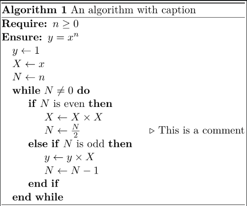
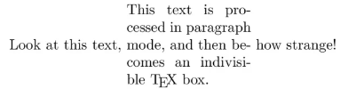
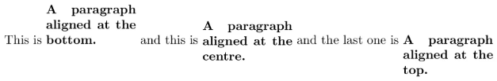

# latex学习笔记

## 示例

```latex
% 定义文档类型
% 英文有article, book, beamer
% 中文有ctexbook, ctexart, ctexbeamer
\documentclass{ctexart}

\documentclass[12pt, a4paper, oneside]{ctexart}  % 默认字体为12pt，A4纸，单面打印

% 加载宏包
\usepackage{amsmath, asthm, amssymb, graphicx}

\title{文档标题}
\author{jab}
\date{\today}

\begin{document}
\maketitle  % 显示标题、作者、日期等
Hello World!  % 正文放在document环境中
\end{document}
```

## 原理

- latex三种模式：paragraph mode（一般情况），math mode, left-to-right mode
- box：当做一个整体的text
  - parbox：paragraph mode下的box
  - minipage：创建parbox

## 插入

### 位置关系

- htbp
  - `h`：当前位置；`t`：页面最上方；`b`：页面最下方；`p`：文档最后
    - 对`table*`和`figure*`，仅`t`和`p`有效果
  - ！：忽略其它内部要求；H：准确地放在文本中的位置（`\usepackage{float}`）
    - ht：优先放在当前页面的上部，若不满足则顺延到下页上部
- 基础技巧
  - 靠左=>靠右：`\usepackage[export]{adjustbox}`，然后在引用图像时加入`[width=0.5\textwidth, right]`
- 宽度
  - `\textwidth`: 整行宽；`\pagewidth`：包含页边宽度，比`\textwidth`大
  - `\linewidth`: 目前环境的宽（在box中就是box的宽度）；`\columnwidth`：栏宽

### 图片

```latex
\begin{figure}[htbp]
    \centering  % 图片居中
    \includegraphics[width=0.95\linewidth]{image.jpg}
    \caption{标题}
    \label{标签，可用于引用图片}
\end{figure}
```

- 建议将图片先转化为eps格式，再插入，jpg格式放大后不清晰
  - windows下可使用latex自带的`bmeps -c [原图像名] [新图像名]`
- `\graphicspath{{imgs/}}`：指定从哪个文件夹中找图片

```latex
\usepackage{graphicx, subfig}

% 多幅图片，仅限并排
\begin{figure}[h]
    \subfloat[子图名]{
        \includegraphics[width=0.45\linewidth]{a.eps}
        \label{fig:sub_a}
    }
    \hfill
    \subfloat[子图名]{
        \includegraphics[width=0.45\linewidth]{b.eps}
        \label{fig:sub_b}
    }
    \caption{Caption for this figure with two images}
    \label{fig:image2}
\end{figure}
```

```latex
% 多幅图片，更多排版设置
\begin{figure}[h]
    \begin{minipage}[b]{0.45\linewidth}  % 创建左侧小区域，可按一般方式进行排版
        \centering
        \includegraphics[width=0.9\linewidth]{demo.jpg}  % 此处\linewidth为minipage的栏宽
        \caption{}
        \label{}
    \end{minipage}
\end{figure}
```

### 表格

- 一般性
  
  - ```latex
    \usepackage{subcaption}
    
    \begin{table}[htbp]
        \centering
        \caption{表格标题}  % 表格标题在上，图标题在下
        \label{表格标签}
        \begin{tabular}{|l|c|r|}  % l为靠左，c为居中，r为靠右，|为竖直边框
        % % \begin{tabular*}{\linewidth}{@{}llll@{}}：占满两栏
            \hline  % 水平边框
            1 & 2 & 3 \\  % &代表对齐，\\代表换行
            \hline
            4 & 5 & 6 \\
            \hline
            7 & 8 & 9 \\
            \hline
        \end{tabular}
    \end{table}
    ```
  
  - `\cline{2-3}`：该行仅第2列到第3列有框线（从1开始算）
  
  - `\begin{table}`仅占用一栏，`\begin{table*}`占用整个页面宽

- 调整大小
  
  - ```latex
    % 调整列间距
    \makebox[0.1\textwidth][c]{第1行列名}  % 写在第1行
    
    % 调整整个表格的行间距和列间距
    \begingroup  % 设置单独的行间距和列间距，不影响其他表格
    \setlength{\tabcolsep}{5pt}  % 调整列间距为5pt，默认是6pt
    \renewcommand{\arraystretch}{1.5}  % 调整行间距为1.5倍，默认是1倍
    % 定义表格
    \endgroup
    
    % 进一步压缩行间距，在\begin{table}和\begin{tabular}之间
    % 保持比例压缩/放大
    \adjustbox{max width=\textwidth}{  % 也可换成width=，强制调整至给定大小
    \begin{tabular}
    }
    ```

- 三线表
  
  - ```latex
    % 三线表
    \usepackage{booktabs}
    % \begin{tabular}之后
    \toprule  % 最上面的粗线
    % 第1行
    \midrule % 中间的细线
    % 下面各行
    \bottomrule  % 最下面的粗线
    
    % \midrule可重复使用多次
    % \cmidrule(l){左列号-右列号}，在两列之间画上连线，列号从1开始计数
    ```
  
  - ```latex
    % 直接在最后加注释
    % 在数据最后一行后定义multicolumn，打通所有单元格，写注释，不画表格线
    \multicolumn{列数}{p{\textwidth}}{注释}  % 也可改成\linewidth
    
    % 对表格中需要加注释的地方标注
    \usepackage{threeparttable,booktabs}
    
    % 三线表
    \begin{threeparttable}  % 在\begin{table}和\begin{tabular}之间
    % \caption放在\begin{threeparttable}和\begin{tabular}之间
    % 需要注释的地方加上\tnote{1}
    % 在\end{tabular}后加上
    \begin{tablenotes}
    \footnotesize
    \item[1] explanation.
    \end{tablenotes}
    % 也可以不加\tnote{}，然后在最后直接使用\item
    ```

- 多行多列
  
  - ```tex
    % 多行：\multirow{合并的行数}{所占大小，默认为*（不加{}）}{文本}，需要\usepackage{multirow}
    % 多行内换行：在文本出填上\shortstack{第1行\\ 第2行}
    
    % 多列：\multicolumn{合并的列数}{对齐格式}{文本}
    % 被合并的位置需要用&空出，但不填东西
    % 若多列左右两侧需要竖线，则需要在{对齐格式里加上|}
    ```

- 表格并排
  
  - ```tex
    \begin{table}
        \centering
        \begin{subtable}[h]{0.45\textwidth}
            \begin{tabular}{cc}
                train & result \\
                0 & 0 \\
            \end{tabular}
        \end{subtable}
        \begin{subtable}[h]{0.45\textwidth}
            \begin{tabular}{cc}
                train & result \\
                0 & 0 \\
            \end{tabular}
        \end{subtable}
    \end{table}
    ```

### 列表

```latex
% itemize为无序列表，enumerate为有序列表，description为描述
\begin{itemize}
    \item 这是第一点
\end{itemize}

\begin{enumerate}
    \item 这是第一点; 
    \item 这是第二点;
    \item 这是第三点. 
\end{enumerate}

\begin{enumerate}
    \item[(1)] 这是第一点; 
    \item[(2)] 这是第二点;
    \item[(3)] 这是第三点. 
\end{enumerate}
```

### 定理

```latex
% {theorem}是环境明后才能
% {定理}指的是该环境显示的名称是“定理”
% [section]让theorem环境在每个section中单独编号
\newtheorem{theorem}{定理}[section]

% 在正文中
\begin{theorem}[定理名称]
    这里是定理的内容
\end{theorem}
```

### 页面

- 使用geometry宏包

```latex
\usepackage{geometry}
\geometry{left=2.54cm, right=2.54cm, top=3.18cm, bottom=3.18cm}
\linespread{1.5}  % 行间距
```

### 页码

```latex
% aiph为小写字母，Aiph为大写字母，Roman为大写罗马数字，arabic为阿拉伯数字
\pagenumbering{roman}
\setcounter{page}{0}  % 页码从0开始
```

### 公式

```latex
% 行内公式
$E=mc^2$
% 行间，或者用$$...$$
% $$无公式号，\begin{equation}有
\begin{equation}\label{eq4}  % 与正文间不空行，为了美观可在空行加%隔开
    E=mc^2
\end{equation}
```

- 大分式：`\dfrac{}{}`；小分式：`\frac{}{}`

- 可变大小括号：`\left(`, `\right)`
  
  - 中间需要隔开：`\left(..\middle|..\right)`

- 字体
  
  - 加粗
    - 公式外加粗：`\bm{}`（需要bm库）
    - 公式外加粗：`\mathbf{}`
  - 取消斜体：`\mathrm{}`

- 在上面加括号注释：`\overbrace{公式}^{注释}`；在下面加括号注释：`\underbrace{公式}_{注释}`

- 分段函数
  
  - ```latex
    $$
    f(x)=\begin{cases}
        x, & x>0, \\
        -x, & x\leq 0.
    \end{cases}
    $$
    ```

- 多行公式
  
  - ```latex
    $$
    \begin{aligned}
    a & =b+c \\
    & =d+e
    \end{aligned}
    $$
    ```

- 矩阵
  
  - ```latex
    $$
    \begin{bmatrix}  % bmatrix为方括号，pmatrix为圆括号
        a & b \\
        c & d
    \end{bmatrix}
    $$
    ```

### 引用

- 引用图、表：`\ref{图、表的label}`，前面需要自行补`Figure`或`Fig.`, `Table`，`Eq.`
  
  - `Figure`或`Fig.`，与图的caption保持一致

- 引用公式：`\eqref`，前面需要自行补Equation

- 引用符号前，最好加上~，例如`~\ref{}`，保证`Table [1]`不会分在2行

- 引用参考文献
  
  - 将bibtex放在refer.bib中
  
  - ```latex
    % 在文章最后加上，说明从refer.bib中寻找参考文献
    \bibliographystyle{IEEEbib}
    \bibliography{refer.bib}
    ```
  
  - 需要引用的地方，使用`\cite{参考文献的关键词}`
    
    - 推荐使用`~\cite{}`
    - 需要自行在前面补`xxx et~al.~\cite{}``
      - ``et al.`适合3个以上作者，不需要斜体
      - `et al.`中间不能分在两行，故得加上`~`，表示前后不能分开

### 算法表

- 不同组合彼此冲突，不能混用

- algpseudocode和algorithm
  
  - 
  
  - ```latex
    \usepackage{algorithm,algpseudocode}
    
    \begin{algorithm}
    \caption{An algorithm with caption}\label{alg:cap}
    \begin{algorithmic}  % 在后面加上[1]表示行号
    \Require $n \geq 0$  % \geq是大于等于
    \Ensure $y = x^n$
    \State $y \gets 1$  % \gets是赋值（左箭头）
    \State $X \gets x$  % \State表示新起一行
    \State $N \gets n$
    \While{$N \neq 0$}  % while循环
    \If{$N$ is even}  % if-else
        \State $X \gets X \times X$
        \State $N \gets \frac{N}{2}$  \Comment{This is a comment}  % 注释
    \ElsIf{$N$ is odd}
        \State $y \gets y \times X$
        \State $N \gets N - 1$
    \EndIf
    \EndWhile
    \For{\texttt{<some condition>}}  % for循环
        \State \texttt{<do stuff>}
    \EndFor
    \Repeat  \Comment{forever}  % repeat-until循环
    \State this
    \Until{you die.}
    \end{algorithmic}
    \end{algorithm}
    ```

### 脚注

- `\footnote{text for footnote}`：标在要解释的正文后面，自动创建脚注
- `\footnote[number]{text for footnote}`：指定脚注数字

### 框

- **\fbox命令**：`\fbox{内容}`，对包裹的内容（构成box）加框
- **\colorbox命令**：`\colorbox{颜色}{内容}`，对包裹的内容填充颜色

## 符号

- `%`：注释
- 省略号：`\cdots`：横向居中省略号；`\vdots`：竖向省略号；`\ddots`：对角线向省略号

### 字体

- `\underline{}`：下划线
- `\textbf{}`：加粗

### 空格

- 小：`\ `（对空格进行转义）；中：`\;`；大：`\quad`

### 其它

- 文本中有下划线，需要转义`\_`

## 排版

### 快捷命令

- `\newpage`：换新页
- `\section{}`：小标题（带编号）
  - `\section*{}`：小标题（不带编号）
- `\subsection{}`，`\subsubsection{}`
- `\centerline{}`：该行居中

### minipage

- minipage：创建parbox
  
  - `\begin{minibox}[position][height][inner-pos]{width}`，`[]`表示可选，`{}`表示必填
  - position
    - `t`：box的第一行与原位置等高
    - `c`：box的中间一行与原位置等高
    - `b`：box的最后一行与原位置等高
  - height：整个box的高度
  - inner-pos：text在box的上下位置
    - `t`; `c`; `b`
  - width：整个box的宽度
    - `em`：当前字体中M的宽度；`ex`：当前字体中x的高度

- 例子
  
  - 
  
  - ```latex
    Look at this text,
    \begin{minipage}{3cm}
    % \setlength{\parindent}{2em}  % 表示开头缩进2字符
    This text is processed in paragraph mode, and then becomes an indivisible \TeX{} box.
    \end{minipage}
    how strange!
    ```
  
  - 
  
  - ```latex
    This is
    \begin{minipage}[b]{2.5cm}
        \textbf{A paragraph aligned at the bottom.}
    \end{minipage}
    and this is
    \begin{minipage}{2.5cm}
        \textbf{A paragraph aligned at the centre.}
    \end{minipage}
    and the last one is 
    \begin{minipage}[t]{2.5cm}
        \textbf{A paragraph aligned at the top.}
    \end{minipage}
    ```
  
  - 

## 操作

### vscode

- `alt+b`: build
- `ctrl+alt+v`: 查看pdf
  - 按ctrl，再双击pdf的位置，可跳转到源码的位置
- 在setting.json中修改latex配置
- `alt+z`：打开或关闭自动换行

### arxiv提交

- overleaf提交：overleaf能自动打包需要的文件，建议用texstudio重新编译检查问题

- 本地提交：参考文献提供在.bbl文件中，需要与.tex文件同名，不需要改.tex文件最后的\bibliography

- tips
  
  - ```latex
    \name{xxx$^1$, xxx$^2$, 
    \thanks{* Corresponding author\newline \indent \indent
    This work was supported by ...}}
    \address{}
    ```
  
  - 让arxiv使用pdflatex编译
    
    - 在前五行空出一行，加入`\pdfoutput=1`
    - 以`.jpg`，`.png`等格式提供图片，不用`.eps`格式
  
  - 避免图片文件名中有下划线_