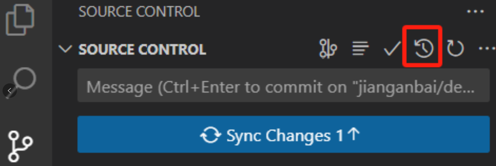
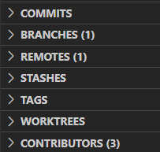
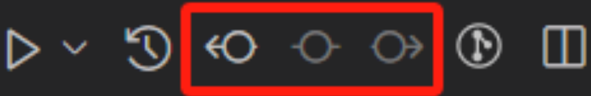
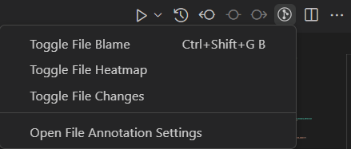

# vscode插件学习笔记

## git

### git graph

- 适合查看commit tree
- 在git graph里比较2个commit
  - 先点击源commit，然后按住ctrl，点击目标commit
  - 源commit里就显示对比结果

### git history

- 适合查看、对比之前的commit
- 查看整体commit tree
  - 
  - more里，可选择对比2个commit
- 查看单个文件的修改记录
  - 选中文件，右键，Git: view file history

### gitlens

- 大而全的插件，高级功能需要付费
- 每行git blame：自动显示每行上次是谁在哪个commit修改
- 功能集成在vscode git 面板里
  - 
  - 查看当前修改
  - 比较2个commit: select for compare, compare with selected
  - interactive rebase：交互式选择rebase哪些修改
- 右上角比较不同commit
  - 
  - alt+点击，可选择比较哪个commit（默认是上一个）
- 切换显示
  - 
  - toggle file blame：显示每行是谁修改的
  - toggle file heatmap：代码左侧显示热力图，最近修改的为暖色
  - toggle file change：显示修改了什么

## python debug

### 常用

```json
  # .vscode/launch.json
  {
    "version": "0.2.0",
    "configurations": [
        {
            "name": "Python: Current File",
            "type": "debugpy",
            "request": "launch",
            "program": "${file}",
            "console": "integratedTerminal",
            "justMyCode": false,  # 可在库代码中设断点
            "env": {  # 指定环境变量
                # vscode当前所在目录，作为启动python的目录。可调试子文件夹下的.py
                "PYTHONPATH": "${workspaceFolder}",
            },
            "args": ["--conf", "a.yaml"]  # 运行python x.py --conf a.yaml
        }
    ]
}
```

### 由shell启动

- 添加`.vscode/launch.json`
  
  - ```json
    {
        "version": "0.2.0",
        "configurations": [
            {
                "name": "Python: Attach",
                "type": "debugpy",
                "request": "attach",
                "connect": {
                    "host": "localhost",
                    "port": 9203  # netstat -tuln 查看已使用端口
                }
            }
        ]
    }
    ```

- debug脚本
  
  - ```shell
    python -m debugpy --listen localhost:12221 --wait-for-client xxx.py [args]
    ```

- debug
  
  - 先在命令行运行debug bash 脚本
  
  - 再使用`Python: Attach`模式开始调试
  
  - 等待自动捕获断点
