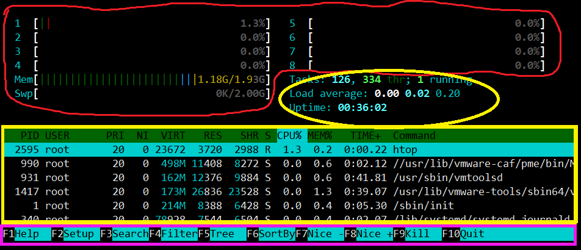

# linux常用工具

- wget
  - `wget [url]`：直接下载到当前文件夹
  - `wget -O [name] [url]`：指定下载后文件的名字
- ssh
  - `ssh -p [端口号] [用户名]@[ip地址]`：使用命令行连接到远程服务器

## 编程相关

- C编程相关

  - `gcc xxx.c -o yyy`：将C代码编译成`yyy`脚本，之后使用`./yyy`即可执行编译后的代码

  - `g++ xxx.c -o yyy`：将C++代码编译成`yyy`脚本，之后使用`./yyy`即可执行编译后的代码

## 系统配置相关

### htop

- 界面

- 

  - 区域1：CPU、内存、Swap的使用情况
  - 区域2：任务、线程、平均负载、运行时间
    - 平均负载以1个核100%运行为1，从左至右分别统计5分钟、10分钟、15分钟
  - 区域3：系统的所有进程
    - PRI和NI：优先级（nice值越低，优先级越高）；VIRT：虚拟内存
    - RES：物理内存；SHR：共享内存；S：进程状态（S休眠、R运行、Z僵死）
    - CPU%：CPU占有率；MEM%：物理内存占有率；TIME：进程占用的CPU总时间

- 快捷键

  - | 快捷键   | 功能                   | 详细信息       |
    | :------- | ---------------------- | -------------- |
    | F1       | 查看htop使用说明       |                |
    | F2       | htop设定               |                |
    | F3, /    | 搜索进程               | 按F3移至下一个 |
    | F4, \    | 进程过滤器             |                |
    | F5, t    | 显示树形结构           |                |
    | F6, <, > | 选择排序方式           |                |
    | F7, [    | 减小nice值，提升优先级 | 需先选定进程   |
    | F8, ]    | 增加nice值，降低优先级 | 需先选定进程   |
    | F9, k    | 对进程传递信号         | 可选信号       |
    | F10, q   | 结束                   |                |
    | u        | 只显示某用户的进程     |                |

- 命令行参数

  - -d：设置延迟更新时间

  - -u：只显示给定用户的进程

  - -p：只显示给定的PID

### tmux

- tmux概念
  - sesssion会话：一系列任务
  - window窗口：1个任务
  - pane窗格：显示屏上同时显示多个终端，它们都属于同一窗口
- 运行tmux
  - `tmux new -s foobar`：新开1个名叫foobar的会话
  - `tmux a -t foobar`：进入已创建好的会话
    - ctrl+b d退出
  - `tmux ls`：查看当前所有的会话
  - `tmux kill-session -t foobar`：删除名为foobar的session
  - `tmux kill-server`：删除所有session
- 快捷键
  - ctrl+b进入tmux快捷键，每个输入1个快捷键前都需要输入1次ctrl+b
    - 默认是ctrl+b，大多数人选择修改为ctrl+a
  - `d`：与当前进程脱离，当前进程仍在运行
    - 先按ctrl+b，再按d：脱离；按住ctrl+b和d：销毁
  - `c`：创建新窗口
  - `p`：进入上一窗口
  - `n`：进入下一窗口
  - `数字`：进入第几个窗口，从0开始，只能输入0-9
  - `'`：输入数字，切换到相应窗口（可切换到10, 11等）
  - `,`：重命名窗口
  - `s`：查看所有tmux session
  - `&`：删除当前窗口
  - `%`：竖直创建新窗格
  - `"`：水平创建新窗格
  - `x`：删除当前窗格
  - `方向键`：在不同窗格间切换
  - `:`：进入命令行模式
    - `set -g mouse on`：所有session转为鼠标模式，可使用鼠标滑轮
    - `clear-history`：删除历史记录（clear只会清空平铺）

## 音频处理相关

### sox

- 提取音频信息：`sox [音频路径] -n stat`
  - 仅提取时长：`sox [音频路径] -n stat | sed -n 's#^Length (seconds):[^0-9]*\([0-9.]*\)$#\1#p'`