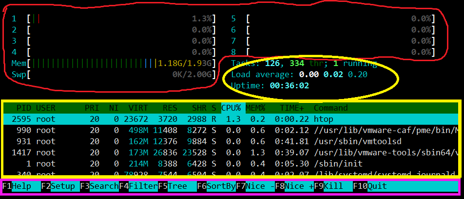
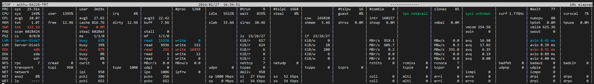

# linux常用工具

- wget
  - `wget [url]`：直接下载到当前文件夹
  - `wget -O [name] [url]`：指定下载后文件的名字
- ssh
  - `ssh -p [端口号] [用户名]@[ip地址]`：使用命令行连接到远程服务器

## 编程相关

- C编程相关
  
  - `gcc xxx.c -o yyy`：将C代码编译成`yyy`脚本，之后使用`./yyy`即可执行编译后的代码
  
  - `g++ xxx.c -o yyy`：将C++代码编译成`yyy`脚本，之后使用`./yyy`即可执行编译后的代码

## 系统配置相关

### htop

- 
  
  - 区域1：CPU、内存、Swap的使用情况
  - 区域2：任务、线程、平均负载、运行时间
    - 平均负载以1个核100%运行为1，从左至右分别统计5分钟、10分钟、15分钟
  - 区域3：系统的所有进程
    - PRI和NI：优先级（nice值越低，优先级越高）；VIRT：虚拟内存
    - RES：物理内存；SHR：共享内存；S：进程状态（S休眠、R运行、Z僵死）
    - CPU%：CPU占有率；MEM%：物理内存占有率；TIME：进程占用的CPU总时间

- 快捷键
  
  - | 快捷键      | 功能            | 详细信息     |
    |:-------- | ------------- | -------- |
    | F1       | 查看htop使用说明    |          |
    | F2       | htop设定        |          |
    | F3, /    | 搜索进程          | 按F3移至下一个 |
    | F4, \    | 进程过滤器         |          |
    | F5, t    | 显示树形结构        |          |
    | F6, <, > | 选择排序方式        |          |
    | F7, [    | 减小nice值，提升优先级 | 需先选定进程   |
    | F8, ]    | 增加nice值，降低优先级 | 需先选定进程   |
    | F9, k    | 对进程传递信号       | 可选信号     |
    | F10, q   | 结束            |          |
    | u        | 只显示某用户的进程     |          |

- 命令行参数
  
  - -d：设置延迟更新时间

- -u：只显示给定用户的进程
  
  - -p：只显示给定的PID

### atop



- 监控系统进程、CPU、内存、硬盘、网络等各项状态
  - `PRC`：系统进程。`sys`：10s内在内核态的时间之和。`usr`：10s内在用户态的时间之和。`#proc`：进程总数。`#exit`：10s内退出的进程数
  - `CPU`：CPU状态。`sys`：CPU在内核态的时间比例。`usr`：CPU在用户态的时间比例。`irq`：CPU中断的比例。`idle`：CPU空闲的比例
  - `CPL`：等待队列。`avg1`：过去1分钟等待队列数。`avg5`：过去5分钟等待队列数。`avg15`：过去15分钟等待队列数
  - `LVM/DSK`：硬盘。`busy`：磁盘忙所占比例。`read`：每秒读入。`write`：每秒写入。`avq`：磁盘平均队列长度。`avio`：磁盘平均io时间

### tmux

- tmux概念
  - sesssion会话：一系列任务
  - window窗口：1个任务
  - pane窗格：显示屏上同时显示多个终端，它们都属于同一窗口
- 运行tmux
  - `tmux new -s foobar`：新开1个名叫foobar的会话
  - `tmux a -t foobar`：进入已创建好的会话
    - ctrl+b d退出
  - `tmux ls`：查看当前所有的会话
  - `tmux kill-session -t foobar`：删除名为foobar的session
  - `tmux kill-server`：删除所有session
  - `tmux rename-session -t [旧名字] [新名字]`
- 快捷键
  - ctrl+b进入tmux快捷键，每个输入1个快捷键前都需要输入1次ctrl+b
    - 默认是ctrl+b，大多数人选择修改为ctrl+a
  - `d`：与当前进程脱离，当前进程仍在运行
    - 先按ctrl+b，再按d：脱离；按住ctrl+b和d：销毁
  - `c`：创建新窗口
  - `p`：进入上一窗口
  - `n`：进入下一窗口
  - `数字`：进入第几个窗口，从0开始，只能输入0-9
  - `'`：输入数字，切换到相应窗口（可切换到10, 11等）
  - `,`：重命名窗口
  - `s`：查看所有tmux session
  - `&`：删除当前窗口
  - `%`：竖直创建新窗格
  - `"`：水平创建新窗格
  - `x`：删除当前窗格
  - `方向键`：在不同窗格间切换
  - `:`：进入命令行模式
    - `set -g mouse on`：所有session转为鼠标模式，可使用鼠标滑轮
    - `clear-history`：删除历史记录（clear只会清空屏幕）
- 操作
  - 复制粘贴
    - 未启用鼠标
      - `ctrl+b`加`[`，进入复制模式
      - 方向键移动光标到起始为止，按下`space`开始选择
      - 移动光标到文本结束位置，按`enter`复制
      - `ctrl+b`加`]`，粘贴已复制的文本
    - 启用鼠标：拖动选中文本，自动复制；右键粘贴

## 音频处理相关

### sox

- `sox`：音频处理（转换、编辑、特效）；`soxi`：查看音频信息

- **sox用法**：`sox [输入文件] [输出文件] [特效参数]`

- 格式转换：匹配文件后缀，自动进行

- 特效
  
  - `sox loud.wav quiet.wav gain -3`：将音量降低3 dB
  
  - `sox input.wav -r 16000 output.wav`：改变采样率
  
  - `sox 第一段.mp3 第二段.mp3 合并后的文件.flac`：连接音频文件

- 查看信息
  
  - `sox [音频路径] -n stat`：提取音频信息
    
    - 仅提取时长：`sox [音频路径] -n stat | sed -n 's#^Length (seconds):[^0-9]*\([0-9.]*\)$#\1#p'`
  
  - `soxi [音频路径]`：提取音频信息

## 任务管理

### task spooler

- 轻量级任务队列管理软件
  
  - 按顺序自动执行队列中的任务，每次执行一个任务
  
  - 可动态添加和删除未执行的任务

- 执行：Ubuntu用`tsp`，但有的Linux系统用`ts`
  
  - ```shell
    tsp your command   # 添加任务到队列。命令直接粘在后面即可，无需引号查看
    ```

- 查看
  
  - ```shell
    tsp -l  # 查看队列状态、任务id
    tsp -c [任务id]  # 持续刷新该任务的stdout（实际通过cat stdout_file）
    tsp -t [任务id]  # 查看任务输出的最后10行
    tsp -p [任务id]  # 查看任务的pid
    tsp -o [任务id]  # 查看任务的stdout_file
    tsp -C  # 从队列中删除已完成任务的结果
    ```
  
  - `tsp -l`
    
    - `E-Level`为执行状态：0为正常退出，1为异常退出，-1为正在进行或tsp丢失进程信息
    
    - `Times(r/u/s)`：`r`为总执行时间（单位为秒），`u`为用户态时间，`s`为内核态时间

- 维护
  
  - ```shell
    tsp -S [并行任务数]  # 设置并行任务数
    tsp -u [任务id]  # 将任务标记为下一个优先执行
    ```

- 中止
  
  - ```shell
    tsp -r [任务id]  # 移除未执行的任务（正在执行的无法移除）
    tsp -k [任务id]  # 中止任务
    tsp -K  # 中止tsp进程，移除队列中的所有任务，但正在执行的任务无法中止
    ```

- 技巧
	- 环境变量
		- `tsp CUDA_VISIBLE_DEVICES=1, 2 python a.py` 不能正确传给子进程，因为tsp 会把`CUDA_VISIBLE_DEVICES=1, 2` 当作命令
		- ```shell
		  # 法1
		  tsp sh -c 'CUDA_VISIBLE_DEVICES=1,2 python a.py'
		  # 法2：提交tsp命令之前定义环境变量，会被tsp进程继承
		  export CUDA_VISIBLE_DEVICES=1,2
		  tsp python a.py
		  ```