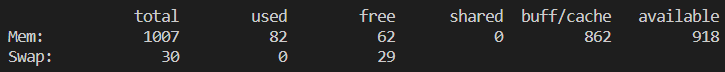

# Shell Tools and Scripting

- 对缩进极其严格

## 基础语法

- **变量**
  
  - 定义变量：`foo=bar`，**赋值时无空格**
  - 变量引用：`$变量名`or`${变量名}`
    - `echo $foo`显示`foo`变量存储的值；`echo foo`则显示`foo`
  - 设置临时环境变量：`export VAR=value`，子shell可继承
  - 预定义的变量：`$USER`：当前用户；`$SHELL`：当前shell

- **引号**
  
  - 单引号`''`被当做纯字符串，双引号`""`会先替换内部的变量
  - `echo '$foo'`输出`$foo`；`echo "$foo"`输出`bar`
  - 反引号``中间填命令，返回命令执行结果

- **$**
  
  - 环境变量：`$PATH`指可执行程序路径 ，`$PWD`指当前文件夹，`$SHELL`指默认shell
  - 位置参数：`$0`：脚本名；`$1`：第1个参数名；`$2-$9`：第2-9个参数名；`$(10)`：第10个参数
  - `$#`参数个数；`$_`：上1个命令的最后1个参数；`$$`：进程号PID；`$@`：所有参数
  - `$?`：存储错误（异常）代号，无错误（异常）则为0
  - `$([命令])`：取某命令的输出结果
  - `!!`：上1个命令。常用于：`sudo !!`，以超级用户执行上1个命令

- **加减乘除**
  
  - ```shell
    a=$((var1+var2))  # 更快，但只能计算整数
    a=$((var+1))  # =前后无空格，加减法前后无空格
    a=$((var1*var2))  # 乘法
    a=$((var1/var2))  # 除法
    
    # expr法也只能计算整数
    a=`expr $var1 + $var2`  # =前后无空格，加减法前后空格
    a=`expr $var + 1`
    a=`expr $var1 \* $var2`  # \为转义
    a=`expr $var1 / $var2`
    a=`expr $var1 % $var2`  # 求余
    
    # 浮点数计算
    a=$(echo "$x*$y" | bc)  # 无法计算负数
    a=$(echo $x $y | awk '{printf("%.5f", $1*$2+3.6)}')  # 最强大
    ```
  
  - `$([命令])`和``都可提取命令的执行结果

- 运行脚本
  
  - 若无运行权限，需要`chmod +x xxx.sh`
  - 法1：加载脚本进命令行：`source xxx.sh`；执行脚本：`mcd test`
    - `source`一般用于更新
  - 法2：`./mcd.sh`
  - 法3：`sh mcd.sh`

- 后台运行
  
  - `command &`：命令在后台运行
  - `nohup command &`：命令在后台运行，不受终端断开影响

## 常用命令

### 系统用户

- 查看用户uid：`id -u`

- 查看用户组
  
  - `cat /etc/group`：查看所有用户组
  - `groups [用户名]`：查看用户所属用户组

- 创建新用户
  
  - ```shell
    sudo useradd xxx  # 不创建密码、主目录、登录脚本
    sudo useradd -m -s /bin/bash xxx  # -m创建主目录；-s指定默认bash
    passwd xxx  # 设定密码
    ```

- **usermod命令**：改变用户的各项属性，`usermod [参数] [用户名]`
  
  - 参数
    
    - `-u 新id`：修改UID；`-d`：修改用户主目录
    - `-g 新组`：修改用户主群组；`-G 新组`：修改用户附加群组
    - `-s 新shell`：修改用户登录shell；`-I 新用户名`：修改用户名
    - `-d 新目录`：修改用户主目录（一般再加上`-m`，移动之前的目录）
    - `-L`：锁定用户；`-U`：解锁用户
  
  - ```shell
    sudo usermod -a -G [用户组名] [用户名]  # 将用户追加到用户组里，-a为追加，-G为不改变用户原来的用户组
    ```

- **chmod命令**：改变文件的权限
  
  - `chmod [参数] [所有者权限][所有者所在组权限][其它用户权限] file`
    
    - 4：读；2：写；1：执行
    - 例如`chmod 750 hello.txt`
  
  - `chmod [用户][+有权限，-无权限][权限] file`
    
    - `u`：文件所有者；`g`：同组；`o`：其它用户；`a`：所有人
    
    - ```shell
      chmod ug+w o -w file  # 文件所有者及同组的可写入，其它用户不可写入
      chmod u+x file  # 仅文件所有者可执行
      chmod +x file  # 所有用户均可执行
      ```
  
  - 参数
    
    - `-R`：改变文件夹及子文件夹的所有文件的权限

- **chown命令**：改变文件所有者
  
  - `chown [参数] [所有者]:[所有用户组] file`：也可只给定所有者
  - 参数
    - `-R`：改变文件夹及子文件夹的所有文件的所有者

### 查看资源

- **lscpu命令**：查看cpu配置

- `nproc --all`：cpu核数

- **uptime命令**：查看机器负载情况

- **free命令**：查看内存配置，`free -m`or`free -g`
  
  - 
  - Mem：物理内存；Swap：虚拟内存（存到硬盘）
  - total：总的；used：使用的；free：完全未被使用的；shared：被多个进程共享的内存
  - buff/cache：buffer是数据在磁盘块的形式，cache是给数据/文件做缓冲
  - available：可立即分配给进程使用的

- **df命令**：查看文件系统存储空间大小
  
  - `df -h`：查看文件系统总存储空间
  - `df -h 文件夹`：查看该文件夹对应挂载盘的存储空间大小
  - 类似的命令：**lsblk命令**

- **du命令**：disk usage，显示磁盘空间的使用情况
  
  - `du [-abcDhHklmsSx] [--exclude=<目录或文件>] [--max-depth=<目录层数>] [目录或文件]`
    - `-a`：分别显示各个文件的大小
    - `-d 1`：查询的最大深度
    - `-s`：仅显示总和
    - `-h`：以K/M/G显示，提升可读性
    - `--exclude='*/'`：不统计符号链接
    - `--max-depth=<目标层数>`：指定最大统计层数

- `watch nvidia-smi`：nvidia-smi查看显卡使用，watch定期刷新

- `gpustat -cpui`：查看显卡使用，需要用pip安装gpustat

- **ps命令**：查看进程统计信息（静态）
  
  - `ps -e`：系统的所有进程信息
  - `ps -x`：当前用户在所有终端的进程
  - `ps -u [username]`：显示指定用户的进程
  - `ps -p [pid]`：显示指定进程号的信息
  - `ps -l`：长格式进程信息；`ps -f`：完整格式进程信息
  - `ps -a`：显示**当前终端**下的所有进程信息，包括其他用户的进程
  - `ps aux`：以简单列表形式显示出进程信息
    - USER：启动该进程的用户账号名称
    - PID：该进程的ID号，在当前系统中是唯一的
    - %CPU：CPU占用的百分比
    - %MEM：内存占用的百分比
    - VSZ：占用虚拟内存（swap空间）的大小
    - RSS：占用常驻内存（物理内存）的大小
    - TTY：该进程在哪个终端上运行。“？”表未知或不需要终端
    - STAT：显示了进程当前的状态，如S（休眠）、R（运行）、Z（僵死）、<（高优先级）、N（低优先级）、s（父进程）、+（前台进程）
    - START：启动该进程的时间
    - TIME：该进程占用CPU时间
    - COMMAND：启动该进程的命令的名称

- **top命令**
  
  - ```shell
    top - 17:03:00 up 17 days,  7:15, 31 users,  load average: 76.10, 74.38, 72.80  # 当前时间17:03，系统已运行17天，当前有31用户登录
    Tasks: 1294 total,  73 running, 1221 sleeping,   0 stopped,   0 zombie  # 进程数
    %Cpu(s): 67.4 us, 26.0 sy,  0.0 ni,  6.2 id,  0.3 wa,  0.0 hi,  0.0 si,  0.0 st  # wa是等待硬盘IO的CPU时间
    MiB Mem : 1030712.+total,  12722.9 free, 139886.5 used, 878102.6 buff/cache  # 物理内存
    MiB Swap: 124999.0 total, 107725.5 free,  17273.5 used. 880481.1 avail Mem  # 交换内存
    
        PID USER      PR  NI    VIRT    RES    SHR S  %CPU  %MEM     TIME+ COMMAND                                                     
    3140619 songhai+  20   0   27.3g   2.7g  15928 S 307.9   0.3  16608:24 ld-linux-x86-64                                             
    3777899 zhaosuc+  20   0   66.8g   3.8g   1.8g S 243.1   0.4  22:41.95 python         
    ```
    
    - ```shell
      us: user cpu time (or)  # CPU time spent in user space
      sy: system cpu time (or)  # CPU time spent in kernel space
      ni: user nice cpu time (or)  # CPU time spent on low priority processes
      id: idle cpu time (or)  # CPU time spent idle
      wa: io wait cpu time (or)  # CPU time spent in wait (on disk)
      hi: hardware irq (or)  # CPU time spent servicing/handling hardware interrupts
      si: software irq (or)  # CPU time spent servicing/handling software interrupts
      st: steal time - -  # CPU time in involuntary wait by virtual cpu while hypervisor is servicing another processor (or) % CPU time stolen from a virtual machine
      ```
  
  - 调用参数：`top -hv|-bcEHiOSs1 -d secs -n max -u|U user -p pid -o fld -w [cols]`
    
    - `-d secs`：改变更新速度
    - `-u user`：仅查看某用户的进程
  
  - 交互参数：运行`top`命令后
    
    - `l`：切换负载信息的显示方式；`m`：切换内存的显示方式
    - `P`：根据CPU使用排序；`M`：根据内存占用排序

- **kill命令**：`kill [-signal] pid`，将信号量发送给对应pid的进程
  
  - 默认发送15信号量，让进程优雅退出并释放资源
  
  - `kill pid1 pid2 pid3 pid4`：同时终止多个进程
  
  - `kill -9 pid`：强制终止进程
  
  - 删除特定进程
    
    - ```shell
      ps -ef | grep {关键词} | grep -v grep | awk 'print $2' | xargs -i kill -9 {}
      ```

- **gpustat**：比nvidia-smi更集成的gpu监视器
  
  - 提供利用率、显存、使用进程等信息
  - 需要在conda环境中安装：`pip install gpustat`
  - 命令：常用`gpustat -cpui`
    - `-c`：显示进程名（进程对应的命令）
    - `-p`：显示进程号PID
    - `-u`：显示进程调用者
    - `-i`：周期性刷新

- **关机重启命令**
  
  - **shutdown命令**：`sudo shutdown [参数] 时间`关机
    - 时间：`now`：立刻关机；数字：等多少分钟关机
  - **reboot命令**：`sudo reboot`，重启

- `netstat`：查看网络连接、端口占用
  
  - 参数
    
    - `-a`：查看所有正在使用和监听的端口
    
    - `-l`：查看所有正在监听的端口
    
    - `-t`：查看TCP连接
    
    - `-u`：查看UDP连接
    
    - `-n`：返回IP地址，不经DNS查找hostname
    
    - `-p`：显示pid
    
    - `-c`：不断刷新结果
  
  - 常用
    
    - ```shell
      netstat -tuln  # 展示所有使用TCP和UDP协议监听的端口
      ```

- **time命令**：记录命令运行时间
  
  - ```shell
    # python -c：以字符串形式输入命令
    time python -c "for i in range(1000000): pass"
    real    0m0.012s  # 总时间
    user    0m0.004s  # 处于用户态的时间
    sys     0m0.008s  # 处于内核态的时间
    ```

### 文件相关

- **find命令**：`find [参数] [查找路径] [查找方式]`
  - 参数
    - `-P`：不跟随symbolic link（默认）
    - `-L`：跟随symbolic link
  - 查找方式
    - `-type`：按类型查，`-type f`查找所有文件，`-type d`查找所有文件夹
    - `-name`：按名字查找，**使用正则表达式时用双引号`""`框起来**
    - `-iname`：按名字查找，不区分大小写
    - `-inum`：按inode查找
    - `-mindepth`：从mindepth深度开始查找（`.`作为深度1）
    - `-maxdepth`：查找到maxdepth
    - `-print`：打印查找结果；`-quit`：找到第1个结果就结束
- **ln命令**`ln [参数] [目标文件或目录] [链接入口]`，创建link
  - 参数`-s`：使用symbolic link，不加则使用hard link
    - 硬链接：无文件，相同inode（不能跨文件系统）
      - `ls -i`：查看inode编号
      - `find . -inum [inode编号]`：查看所有指向同一个inode的文件
    - 软连接：文件中写目标路径
  - 文件夹必须使用symbolic，且ln自动创建入口文件夹，不能先mkdir再ln
    - 可通过`realpath .`获得链接真实路径
- **less命令**：显示文件，类似vim，比cat更强大，**不打开全部文件**
- 参数：`-N`：显示行号
  - 操作：上下滑动翻页，`g`跳到开头，`G`跳到结尾，`q`退出
- **more命令**：翻页查看输出，例如less命令与`cat xxx | more`命令类似
  - more命令需要先读完整个文件
- **lsof命令**：查看哪些文件被哪些进程使用
  - Linux中的程序都是文件
  - 参数
    - `-u 用户名`：查看单个用户打开的文件
    - `-i 4`：查看IPv4所有打开的网络文件
- **打包压缩**
  - `tar.gz`：tar用于打包，gzip用于压缩
    - linux系统上最常用的打包压缩工具
    - 打包压缩：`tar -czvf xxx.tar.gz file1 file2 file3`
      - `-r`：递归，将子文件夹一并打包
      - `--exclude='path'`：不打包指定文件/文件夹，可输入多次
    - 解压缩：`tar -xzvf xxx.tar.gz`
  - `zip`：打包和压缩二合一
    - 打包压缩：`zip -rq xxx.zip xxx`，`-r`表示递归，`-q`表示安静操作
      - `-x file`：不打包指定文件；`-x dir/\*`：不打包指定文件夹
    - 解压缩：`unzip xxx.zip`，`-d xxx`更换解压路径
  - `rar`
    - windows常用格式，linux上分别需要安装`rar`和`unrar`
    - 解压缩
      - `unrar l data.rar`：列出文件列表
      - `unrar x data.rar /path/to/destination`：解压缩
      - `unrar x data.part01.rar /path/to/destination`：自动将不同部分一起解压缩
- 比较文件是否相同
  - `md5sum [file]`：给出文件的md5编码值
  - `cmp [file1] [file2]`：若相同则无输出，若不同则输出第一个不同字节的位置
- 其它
  - `cd ${dir}/../script`：进入dir上层文件夹中的script文件夹
  - `echo ${file/\.flac/.wav}`：修改文件路径中的扩展名，从flac改成wav

### 路径相关

- **脚本内的路径，为运行脚本的cmd所处的路径**

- `dirname`
  
  - `dirname [文件路径]`：去除路径中的文件名，路径可以是绝对路径，也可以是相对路径
  - `curdir=$(cd $(dirname $0);pwd)`：`$0`为脚本路径，该命令进入并显示文件夹绝对路径

- `basename`
  
  - `basename [文件路径]`：去除路径中的文件夹名
  - `basename -s [后缀名] [文件路径]`：去除文件夹名和后缀名

- `realpath [文件名]`：获取文件的绝对路径
  
  - `realpath --relative-to="$file1" "$file2"`：获取`$file2`相对于`$file1`的相对路径

- **which命令**：判断命令在系统中是否存在，若存在则返回执行该命令的可执行文件
  
  - ```shell
    which shell  # /bin/sh
    which python  # /usr/bin/python
    ```
  
  - `-a`：显示所有符合条件的命令

### 变量相关

- **declare命令**：`declare [变量类型] [name[=value]]`，声明变量，可同时给出变量值
  - `-a`：数组；`-f`：函数；`-i`：整数；`-l`：小写字母；`-u`：大写字母；`-r`：只读；`-x`：环境变量
- **sort命令**：对输入进行排序
  - 参数：`-r`：从大至小逆序输出；`-n`：按数字大小比较（默认按字符比较）；`-k x`：选定第x列进行比较

### 运行程序

- 执行脚本文件，是原bash新创建1个bash，在新bash执行脚本文件

- **source命令**：执行给定的文件，一般用于更新环境变量，如`source ~/.bashrc`
  
  - `source`可简写为`.`

- **xargs命令**：从标准输入或管道，读入命令的参数
  
  - 参数
    
    - `-n [一次读入的参数个数]`
    - `-I`：指定替换位置，如`xargs -I% basename % .flac`，替换%
    - `-i`：默认替换`{}`位置，如`xargs -i cp [文件夹1]/{} [文件夹2]`
    - `-t`：运行前打印命令
    - `-P [并行的进程数]`：与`-n`配合，每个参数并行运算
  
  - ```shell
    find . -type d -name "engine*" | xargs -i sh -c "ls -l {} | wc -l"  # 统计所有以engine开头的文件夹内的文件数目
    ```

### 输入输出

- 输入输出的文件描述符
  
  - 标准输入stdin：0
  - 标准输出stdout：1
  - 标准错误输出stderr：2

- **输出输出重定向**
  
  - `>`：重定向stdout，覆盖（等价于`1>`）；`>>`：重定向stdout，追加；`2>`：重定向stderr
  
  - `2>&1`：`&1`取stdout的地址，将stderr也写入stdout的地址
  
  - ```shell
    cat hello.sh > world.sh
    echo hello world > hi.txt
    bash xxx.sh > xxx.log 2>&1  # 将命令执行结果，写入xxx.log，stdout和stderr都写到一起
    bash xxx.sh > /dev/null  # 不显示执行结果，/dev/null类似于“黑洞”
    ```

- **cat命令**
  
  - `cat [文件路径]`：在标准输出（命令行）打印文件
  
  - ```shell
    cat << EOF > hello.txt  # 把以下字符写入hello.txt，遇到EOF时停止
    Hello World
    EOF  # 回车换行，EOF表示文件终止，EOF必须单独成行且前面没有空格等字符
    ```

- **nl命令**：在标准输出（命令行）打印文件，同时加上行号

- **watch命令**：`watch [参数] [命令]`，周期性执行某命令
  
  - `-n [刷新周期]`：默认2秒一刷新
  
  - `-d`：高亮变化
  
  - watch组合命令：通过管道组合，使用''框起命令，`watch "ls -l | grep .npy"`

### 文本处理

#### grep

- **grep命令**：`grep [option] pattern file`
  - 也可以不加file，通过管道读入：`ps -ef | grep xxx`
  - 以行为单位处理
  - **通常使用正则表达式**
- 参数
  - `-C[行数]`：打印匹配行前后几行，如`grep -C2 aaa test.sh`
  - `-c`：统计匹配的行数
  - `-f`：从文件读取匹配的pattern，如`grep -f grep.txt test.sh`
  - `-i`：忽略大小写
  - `-v`：去除匹配的

```shell
# ls -l开头：drwx-r-...，以d开头为文件夹，以-开头为文件
ls -l | grep ^d  # 获得所有文件夹（每行以d开头的）
ls -d */  # 获得所有文件夹名
ls -l | grep ^-  # 获得所有文件
```

#### sed

- **sed命令**：以行为单位处理
  
  - 一般前接`cat`、`ls`、`nl`等命令，然后用管道将数据传给`sed`
  - 也可以在最后加上文件名， 直接读取文件，然后打印在命令行

- `sed [-nefr] [动作] [文件名]`
  
  - `-n`：silent模式，不再打印
  - `-e`：1条sed命令，执行多次动作
  - `-f`：从文件读取sed的命令，`-f filename`
  - `-r`：扩展的正则表达式
  - `-i`：将原文件备份，再修改原文件，`-i copy`指定备份文件的后缀，`-i""`代表不备份

- 动作
  
  - `a`：新增，`[行数]a [新增行]`，在指定行后新增行，`a`和`i`后可加空格，可加`\`
    
    - ```shell
      sed '2a Drink tea'  # 在第2行后新增行Drink tea
      sed '/Linux/a Happy'  # 在所有出现Linux的行后新增行Happy
      sed '/Linux/,/linux/a Happy'  # 在所有出现Linux或linux的行后新增Happy
      ```
  
  - `i`：插入，`[行数]i [插入行]`，在指定行前插入行
  
  - `d`：删除，`[行数区间]d`，后面不接字符串
    
    - ```shell
      sed -n '3,$d'  # 删除第3到最后行
      sed -e '2,5d' '6,$d'  # 删除第2到5行、第6到最后行
      ```
  
  - `p`：打印**选择的数据**，往往与`-n`配合
    
    - ```shell
      sed -n '/root/p'  # 打印开头为root的行
      sed -n '2,5p'  # 打印第2到5行
      sed -n '1~2p'  # 只打印奇数行
      sed -n "1~${a}p"  # 打印至a行
      ```
    - ```shell
      #是分隔号，等价于/，/有时会出现在待匹配的路径里
      # 匹配'Length (seconds):     28.107375'中的时长
      sed -n 's#^Length (seconds):[^0-9]*\([0-9.]*\)$#\1#p'  # \(\)表示捕获组；\1表示引用第1个捕获组
      # s代表替换，^代表在开头匹配，$代表行结束
      ```

- `c`：以行为单位替换
  
  - `s`：替换，`s/[原字符串]/[替换字符串]/`，可用正则表达式
    
    - ```shell
      sed 's/[原字符串]/[替换字符串]/g'  # 不加g默认只替换每行第1个匹配上的，加g替换所有匹配上的
      sed 's/^/###/g'  # 在每行开头插入###
      sed 's/$/###/g'  # 在每行结尾插入###
      sed $'s/\r$//'  # windows每行末尾是\r\n，拷到linux上要去掉每行末尾的\r
      ```

#### awk

- **awk命令**：按行读入，按**分隔符**切分为不同字段
  
  - `grep`适合搜索（方便）、`sed`适合替换、`awk`适合处理数据并生成特定文本（功能最全但复杂）

- `awk [参数] '[匹配条件] {动作}' [文件名]`
  
  - 内建变量
    - `$0`：当前行的整行；`$n`：当前行的第n个字符（从1开始计数）
    - `NF`：当前行的字段个数；`NR`：当前行的行号
      - `$NF`：当前行最后一个字段
    - `FS`：输入字段分隔符；`OFS`：输出字段分隔符；`ORS`：输出行间隔符
  - 参数
    - `-F`：指定字段分隔符，用双引号，如`awk -F ":" '{print $0}'`
    - `-v`：变量赋值
      - ```shell
        awk -v var=100 '{print $0":"v}'
        a=100
        awk -v b="$a" '{print $b}'  # 使用外部变量赋值，打印第100项
        ```
      - 
  - 匹配条件可采用正则表达式，`/正则表达式/`

- 打印
  
  - 打印可自由切换`print`和`printf`
    
    - `printf`：需要自己定义输出格式
      
      - `printf "格式化", 变量1, 变量2`
      - 默认不换行，若最后1次printf未换行，则会显示`%`
    
    - `print`：定义好部分格式的printf，如每次print默认用`\n`分隔
  
  - ```shell
    awk 'NR==1,NR==3{print}' a.txt  # 打印第1-3行，print默认是print $0
    awk 'NR>=1||NR<=3{print $0}' a.txt  # 打印第1或3行
    awk '(NR%2)==1{print $0}' a.txt  # 打印奇数行
    
    awk '/^bash/{print $0}' a.txt  # 打印以bash开头的行
    awk '/\.sh$/{print $0}' a.txt  # 打印以sh结尾的行
    
    # print多个变量用逗号隔开，固定字符用双引号
    awk -F ":" '{print NR,$NF}' passwd  # 打印“行号 最后一个字段”，如1 /bin/bash
    awk -F ":" '{print $1"=="$3}' passwd
    
    awk -F ":" '$3>50{print $1,$3}' passwd
    ```

- 条件运算符
  
  - ```shell
    awk -F ":" '{max=($3>$4)?$3:$4;{print max}}' passwd
    ```

- awk内嵌管道
  
  - ```shell
    awk -F ":" '/bash$/{print|"wc -l"}' passwd  # 管道后接的命令用双引号
    ```

- BEGIN和END
  
  - `awk 'BEGIN{处理前的命令}条件{处理输入行的动作}END{处理后的命令}'`
    
    - 先执行`BEGIN{}`内的命令，再对输入行重复处理，再执行`END{}`内的命令
  
  - ```shell
    awk 'BEGIN{sum=0}{sum+=$1}END{print sum}'  # 计算所有行开头字段之和
    ```

- **awk浮点数计算**
  
  - ```shell
    echo $x $y | awk '{printf("%.5f\n", $1*$2+3.6)}'
    ```

#### 其它

- **cut命令**：从stdin/文件中，筛选出特定列
  
  - `cut -f [要保留的列] -d [分隔符，用双引号] [文件，空则从stdin读入]`
    - `-f 1,3`：保留第1列和第3列（从1开始计数）
    - `-f 2-`：保留第2列到最后，仅去除第1列

- **paste命令**：合并文件的行
  
  - `paste [-s] [-d <间隔字符>] file1 file2 file3`
  
  - 默认：将几个文件的各行依次拼接起来
    
    - ```shell
      tom 1  # file1
      jerry 2 # file2
      >> paste file1 file2 > file3
      tome 1  # file3
      jerry 2
      ```
  
  - `-s`：将1个文件各行拼接成1列
    
    - ```shell
      paste -s file3  # tom 1 jerry 2
      ```

- **head命令**：显示开始几行，`head -n [<line>] -f [<file]`，若未给定file，则从stdin读取

- **tail命令**：显示最后几行，`tail -n [<line>] -f [<file>]`，若未给定file，则从stdin读取

- **tr命令**：`tr [-cd] [字符集1] [字符集2]`，将出现在字符集1的字符，替换为字符集2的字符
  
  - `tr a-z A-Z`：小写转大写
  - `-c`：反选；`-d`：删除在字符集1的字符

- **comm命令**：逐行比较2个文件是否相同
  
  - `comm [-123] file1 file2`，`-1`不显示file1特有的，`-2`不显示file2特有的，`-3`不显示两文件共有的

- **读取文件**
  
  - ```shell
    # 逐行读取文件
    while IFS= read line; do
        echo $line
    done < $file  # 最后一行必为空行，否则会少读一行
    ```

### 下载相关

- 包管理
  - Debian/Ubuntu: `apt-get`；Centos: `yum`
  - `sudo apt-get install xxx`：安装包
  - `sudo apt-get update`：获取所有包的最新版本信息（包缓存）；`sudo apt-get upgrade`：下载并更新
- **wget命令**: `wget [option] [URL]`
  - 参数
    - `-O [文件名]`：指定下载到本地的文件名
    - `-P [文件夹名]`：指定下载的文件夹名
    - `-c`：断点续传；`-t [重试次数]`；`-T [超时等待时间]`
    - `--limit-rate=20k`：限速20kB/s下载
    - `-q`：安静模式
  - 使用
    - `wget --post-file=/path/to/your/file url`：上传文件
- **curl命令**: `curl [options] [URL]`
  - 参数
    - `-o [文件名]`：将输出保存在文件，而非打印
    - `-I`：只下载HTTP headers
    - `-L`：跟随重定位
    - `-s`：安静模式
  - 使用
    - `curl -F "file=@/path/to/your/file" url`：下载文件

### 网络相关

- **ssh命令**：通过ssh连接到服务器
  
  - `ssh [-l login_name] [-p port_number] [-i identity_file] remote_host 'command'`
    
    - `-i`：指定使用哪个private key
    - `command`：登录后执行的命令，若连续执行多条命令，则用分号隔开
  
  - 也可写成`ssh [user]@[ip address] 'command'`
  
  - 多个ssh key管理
    
    - ```yaml
      Host server1  # 可直接使用ssh server1连接
          HostName 1.2.3.4  # IP地址
          IdentityFile ~/.ssh/realname_rsa  # 指定server1的private key
          User aaa  # 用户名
      
      Host server2
          HostName realname2.example.org
          IdentityFile ~/.ssh/realname2_rsa  # different private key for realname2
          User remoteusername
      ```

- **scp命令**：主机间拷贝数据
  
  - `scp -P [port] [local path] [user]@[ip address]:[remote path]`：将本地文件拷贝到服务器端
    - 使用ssh连接的服务器，一般要指定通过ssh的端口连接（默认是22，很多会为了安全改一下）
    - `scp -r`：直接拷贝文件夹，不需要先打包
  - `scp -P [port] [user]@[ip address]:[remote path] [local path]`：将服务器文件拷贝到本地
    - 2条scp命令均需在本地使用
  - 参数
    - `-i [identity_file]`：指定使用哪个private key

- **rsync命令**：文件同步
  
  - 模板
    
    - 本地同步：`rsync [OPTION...] SRC... [DEST]`
    - 远程pull：`rsync [OPTION...] [USER@]HOST:SRC... [DEST]`
    - 远程push：`rsync [OPTION...] SRC... [USER@]HOST:DEST`
      - 若`SRC`以`/`结尾，则将其下所有文件传到`DEST`文件夹下
      - 若`SRC`不以`/`结尾，则将该文件/文件夹传到`DEST`文件夹下
  
  - 机制
    
    - quick check：若modify time和文件大小相同，则不同步
  
  - 参数
    
    - `-r`：递归传文件夹
    - `-t`：同步modify time（默认不同步）
    - `-I`：时间戳相同的不skip
    - `-v`：显示更多信息
    - `-l`：将软链接拷贝为软链接（默认不拷贝）；`-L`：拷贝软连接指向的文件
    - `-P`：等价于`--partial`和`--progress`
      - `--partial`：只传了一部分，连接断了，不删除文件，断点重传
      - `--progress`：显示进度条
    - `-e`：指定协议，如ssh，默认是`-e ssh`
      - 若ssh有参数：`-e 'ssh -i /home/xxx/.ssh/id_rsa'`指定用哪个ssh key
    - `--exclude '/dir/'`：不传输某文件夹
      - 若路径以`/`开始，则是相对于source路径

### 其它

- **set命令**：写在脚本文件中，指定执行时的规则
  
  - `set -u`：若遇到未知变量，bash默认忽略。加上`set -u`后，若遇到未知变量，会报错
  - `set -x`：输出前显示该行命令
  - `set -e`：若有命令执行失败，bash默认继续执行。加上`set -e`后，若发生错误，则终止执行
  - `set -o pipefail`：`set -e`无法约束管道，加上`set -o pipefail`后，只要管道中一个子命令失败，则终止执行

- **seq命令**：生成序列（不是数组），类似于python的range
  
  - ```shell
    seq 1 5  # 1 2 3 4 5，含最后1项，1和5可替换为变量
    seq 1 2 10  # 隔2
    seq 5 -1 1
    ```

- **shopt命令**：开启/关闭shell的隐藏行为
  
  - `shopt -s xxx`：开启；`shopt -u xxx`：关闭；`shopt -p`：打印所有隐藏行为
  - `shopt -s autocd`：autocd可省去cd，输入文件夹，自动进入

- **linux的时间**
  
  - modify time：最后一次修改文件/文件夹的时间（内容）
    - `ls -l`展示的就是modify time
  - change time：最后一次改变文件/文件夹的时间（属性、位置）
  - access time：最后一次访问文件/文件夹的时间

## 结构

### 运算符

- 逻辑运算：`&&`，`||`
- 位运算：
  - `<<`，`>>`：左移 or 右移
  - `&`：按位与；`|`：按位或；`~`：按位非；`^`：按位异或
- 判断
  - `-eq`：等于（只能用于整型），`-ne`：不等于，`-gt`：大于，`-lt`：小于，`-ge`：大于等于，`-le`：小于等于
  - `==`：等于（最通用）；`=~`：`[[ "string" =~ pattern ]]`，判断string能否被正则表达式pattern匹配上
  - `:=`：若未赋初值则赋值，若已赋初值则不赋值
  - `-d`：若目录存在，返回真；`-e`：若文件存在，返回真；`-f`：若是文件，返回真
    - `[ ! -d /tmp ]`：
  - `-n`：若变量非空，返回真；`-z`：若变量值为0，返回真
    - `[ ! -n "${TEST}" ]`

### 分支循环

- 条件：`[ 条件 ]` or `[[ 条件 ]]`（前后都有空格）
  
  - 多个条件：`[ 条件1 ] && [ 条件2 ]`，`[ 条件1 ] || [ 条件2 ]`
  
  - ```shell
    [ -a FILE ]  # 若文件不存在，则为True
    [ -z STRING ]  # 若字符串长为零，则为True
    [[ ${flag} == true ]]
    ```

- 分支：
  
  - ```shell
    if 条件表达式; then
        命令
    elif 条件表达式; then
        命令
    else
        命令    
    fi
    if 条件表达式; then 命令; fi
    ```

- for循环：
  
  - break、continue、exit
  
  - ```shell
    for 变量名 in 取值列表; do
        命令
    done
    ```
  
  - ```shell
    for i in {1..10}; do  # 包含尾项10
        echo $i
    done
    for ((i=0; i<n; i++)); do
        echo $i
    done
    for i in $(seq 0 $END); do echo $i; done  # 逐行打印0-$END的值，包含$END
    for x in lib hello_py pth; do  # 以空格分割
        echo $x
    done
    for x in 1 2 5 6; do
        echo `$x + 2`
    done
    ```
  
  - ```shell
    # 例
    list="i am happy_haha haha_i_am_happy"
    for x in list; do  # 按空格分隔
        echo $x
    done
    ```

- while循环：
  
  - ```shell
    while 条件变量; do
        命令
    done
    ```

### 数组

- 定义数组
  
  - ```shell
    array=(1 2 3 4)  # 索引数组，通过${array[1]}访问
    array=([name]=foo [age]=bar)  # 关联数组，通过array[foo]访问，类似于字典
    ```
  
  - **bash的下标从0开始，zsh的下标从1开始**

- 处理数组
  
  - ```shell
    array[-1]  # 获取最后一个元素
    echo ${array[*]} or echo ${array[@]}  # 获取所有元素的值
    echo ${#array[*]}  # 获取元素个数
    echo ${!array[@]}  # 获取数组下标（关联数组获取key）
    ```
  
  - ```shell
    for i in "${array[@]}"; do  # 打印所有元素值
        echo $i
    done
    for i in ${!array[@]}; do  # 打印所有元素下标
        echo $i
    done
    ```

### 函数

- 函数定义
  
  - ```shell
    # 格式1
    function hello{
        echo 'hello'
    }
    # 格式2
    hello() {
        echo 'hello'
    }
    ```
  
  - 返回值
    
    - return返回值：只能返回0-255，超出则取余
    - echo返回值：在函数里echo
  
  - 传参：**不写在开头，通过$访问**
    
    - `$1`：第1个参数；`$#`：参数个数

- 调用函数：`函数名 第1个参数 第2个参数 ...`
  
  - 不加括号

### 多进程

- **后台进程**
  
  - **nohup**：写在原始命令最前面，不挂断 (no hang up)，日志写到nohup.out中，但无法进行交互（输入密码等）
  - **&**：写在原始命令最后面，可进行交互，但关闭终端后命令自动停止
  - `nohup command &`：不挂断、可交互

- **sleep命令**：阻塞指定时间
  
  - ```shell
    sleep 10s  # 阻塞10s，等价于sleep 10
    # sleep 2m; sleep 2h; sleep 3d
    ```

- **wait命令**：等待子进程完成
  
  - `$!`：最后一个后台进程的PID；`$?`：最后一个进程的退出状态
  
  - ```shell
    wait  # 阻塞至全部进程完成，再运行
    wait $PID  # 仅阻塞至$PID进程完成，再运行
    ```

## Shell脚本

- 命令行可执行很多语言的脚本：shell, bash, python

- ```bash
  mcd () {
      mkdir -p "$1"  # $1代表输入的第1个参数（文件夹名），相当于argv[0]
      cd "$1"  # 进入该文件夹
  }
  ```

- ```bash
  echo "Starting program at $(date)"  # $(date)为系统时间
  echo "Running program $0 with $# arguments with pid $$"  # $0：脚本名；$#：参数个数；$$：进程号
  for file in "$@"; do  # $@类似于迭代器
      grep foobar "$file" > /dev/null 2> /dev/null  # /dev/null是1个写入后无法保存的路径
      if [["$?" -ne 0]]; then  # -ne是不等于
          echo "File $file does not have any foobar, adding one"
          echo "# foobar" >> "$file"  # 在文件最后添加
      fi
  done
  ```

- ```shell
  . ./path.sh  # 在path.sh中用export定义环境变量
  # 不同bash相当于不同进程，无法通信。通过. ./path.sh，在执行主命令前先定义环境变量
  ```

- `shellcheck`：查看shell脚本语法错误

### 调试

#### bashdb

- 类似于gdb
- `bashdb --debug test.sh`
  - `n`：单步调试，不进入函数
  - `s`：单步调试，进入函数
  - `b n`：在第n行设置断点
  - `c n `：执行n步，或执行到断点

#### bash-debug

- vscode：安装`bash-debug`插件，在launch.json中配置shell路径、参数

### 例子

- `:(){:|:&};:`：fork bomb
  
  - `:()`定义了1个名叫`:`的方法（函数）
  
  - 函数`:`的内容是运行1个函数`:`，然后将其结果通过管道送入另1个函数`:`，2个函数都是在后台运行的
  
  - 最后的`:`表示第1次运行`:`

- ```shell
  find $dir/ -name "*.flac" | sort | xargs -I% basename % .flac | \
    awk -v "dir=$dir" '{printf "%s %s/%s.flac\n", $0, dir, $0}' >>$file|| exit 1  # 缩进为2格
  # 寻找所有flac文件 => 获取文件名 => 提取出{文件名：文件路径} => 写入文件
  ```

## Python脚本

- 在脚本第1行加上：`# !/user/bin/env python`，可自动从环境变量中选取python编译器
