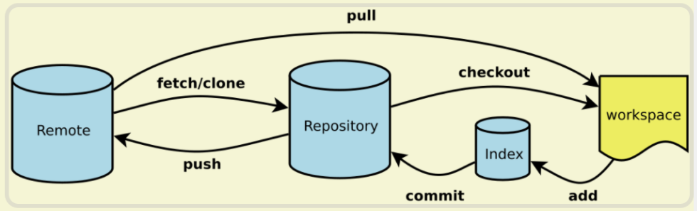

# git版本控制

- 以下命令既可以在shell/cmd中跑，也可在git bash中跑

## 原理

### 版本控制原理

- 3个区域
  
  - `working zone`工作区：修改代码，但未`git add`
  - `staged zone`暂存区：`git add`后
  - `repository`仓库：`git commit`后

- 分支树
  
  - ```python
    ... o ---- o ---- A ---- B  origin/main (upstream work)
                       \
                        C  main(your work)
    ```
  
  - 每个节点是1个commit
    
    - ```c
      type commit = struct {  // 每次提交的数据结构
          parents: array;  // 指向父节点的指针
          author: string;
          message: string;
          snapshot: tree;  // 开发流程树
      }
      ```
  
  - 每个分支有1个指针（如: HEAD），指向该分支最新的节点
    
    - `git merge dev`有无冲突：HEAD节点是否是dev节点的父节点

### 工作流程



#### 分支管理

- main分支作为稳定版，仅在发布新版本时更新，不直接修改main分支
- 开发新版本：从main分支checkout出dev分支
  - 每个人从dev分支checkout出自己的分支（如`aaa/dev`），然后在自己的分支上commit
  - 修改自己的分支后，merge进dev分支
  - 新版本开发完毕，将dev分支merge进main分支
- 修bug
  - 从main分支checkout出临时分支，修bug
  - 然后merge回main分支，再删除临时分支
- 一般不push本地临时分支（修bug这种），只push main, dev这种

#### github

- 从别人的仓库fork到自己的仓库
- 将自己的仓库clone到本地
- 在本地上修改
- 检查upstream仓库是否有更新，有则fetch + merge / rebase
- 将本地的修改push到自己fork的仓库中
- 从自己fork的仓库向别人的仓库发pull request

#### 具体场景

- 对已有分支修改：先创建新分支，修改后commit，再merge进已有分支，最后删除新分支
  - merge之前不直接修改已有分支，更安全
- 若本地有修改，remote又有人修改
  - 则先把本地commit，然后把remote的代码pull下来
  - 视需求，采用merge或rebase

## 语法

### 创建仓库

#### git init

- `git init`：在本地创建仓库
  - 可在已有代码上创建
  - 再通过`git remote add`加入远端仓库
- 会在仓库根目录下创建`.git`，该目录是git记录分支树的文件夹

#### git clone

- `git clone`：下载远程仓库
  - `git clone [url] [folder name]`
    - 仓库地址为url，下载仓库到folder name
    - `url`可以是网络地址，也可以是本地路径
  - 参数
    - `-b [分支名]`：只下载指定的分支
    - `--depth 1`：只下载最近1次commit
    - `--bare`：只下载`.git`目录，不下载其它文件

### 分支相关

- git指针
  - `HEAD`：当前所在commit; `HEAD^`：当前所在commit的前1个commIt
  - Branches：指向各个分支的最新commit
  - Remotes：指向远程分支的最新commit
  - Tags：指向tag

#### git branch

- `git branch`：展示所有分支名
  
  - `git branch -vv`：展示各个分支的一些信息
  - `git branch -r`：查看远端仓库的所有分支

- `git branch [name]`：创建名为name的分支

- 修改
  
  - `git branch -m [新名字]`：修改本地分支名（需要先在该分支上）
  
  - `git branch -d [分支名]`：删除本地已合并的分支，若未合并，将`-d`替换为`-D`强行删除
  
  - `git branch --set-upstream-to=origin/master`：设置默认推送的远程仓库

#### git checkout

- `git checkout [name]`：切换进名为name的分支
  - `checkout`将`HEAD`指针移动到某个分支
  - `git checkout [hash]`：输入某个节点的hash值（可只输入前缀），切换至该节点
  - `git checkout -b [name]`：创建名为name的分支并切换进
  - `git checkout -b [name] origin/main`：创建新分支，并从`origin/main`下载代码至该分支
- `git checkout [commit hash]`：`HEAD`切换到某commit
  - 若未修改，`git checkout [分支名]`切换到该分支的头部
- `git checkout [commit] -- [文件]`：将文件回退至指定commit
  - 若未指定文件，则回退整个仓库
  - 若未指定`commit`，则回退至最近的`git commit`或`git add`
- `git rev-parse [指针名]`：给出该指针指向commit的hash

#### git switch

- 相比于`git checkout`，`git switch`只用来切换分支
  - `git switch [分支名]`：切换到指定分支
  - `git switch -c [分支名]`：创建并切换到新分支

### 查看&对比&标记

#### git status

#### git log

- `git log`：给出文字版的提交记录
  - `git log --all --graph --decorate`
  - `git log --all --graph --decorate --oneline`

#### git diff

- `git diff`：对比未提交与已提交
  - `git diff [hash] [file_name]`：查看某文件在hash分支与当前分支的区别
    - 不填`[hash]`，则默认为当前分支前一commit
  - `git diff [本地分支名]`：比较指定分支与当前分支
  - `git diff origin/[远程分支名]`：比较本地当前分支与远程分支

#### git blame

- `git blame [文件名]`：查看文件每行是谁修改的

#### git reflog

- `git reflog`：记录输入的git命令

#### git tag

- `git tag [标签名] [commit]`：为指定commit打上标签，如v1.0
  - `git tag -a [标签名] [commit] -m "文字" [commit]`：打标签时补上说明文字
    - `-a`：annotated tag
    - 缺失`[commit]`则默认为`HEAD`
- 处理tag
  - `git show [标签名]`：展示该标签对应的commit
  - `git tag`：展示所有tag
    - `-n1`：同时展示说明
  - `git push origin [标签名]`：将本地指定标签同步到远程
  - `git push origin --tags`：将本地所有标签同步到远程
    - tag只是指向commit的指针，不与branch绑定，故不用指定branch
  - `git fetch --tags`：从远程下载tag
- 删除tag
  - `git tag -d [标签名]`：本地删除标签
  - `git push origin :refs/tags/[标签名]`：本地删除标签后，删除远程的标签

### 更新代码

#### git fetch

- `git fetch origin [远程分支]:[本地分支]`：将远程分支下载到本地分支，不进行merge
  - 参数
    - `--unshallow`：下载全部历史

#### git pull

- `git pull`：`git fetch`+`git merge`，下载远端分支+将下载结果与本地结果合并
  - `git pull origin [远程分支]:[本地分支]`：将远程指定分支拉取到本地指定分支（默认为当前分支）
  - `git pull origin [远程分支] --rebase`：采用rebase方法进行合并

### 合并相关

```markdown
... o ---- o ---- A ---- B  origin/main (upstream work)
                   \
                    C  main(your work)
# merge
... o ---- o ---- A ---- B  origin/main (upstream work)
                   \      \
                    C ---- M  main (your work)
# rebase
... o ---- o ---- A ---- B  origin/main (upstream work)
                          \
                           C'  main (your work)
```

- **无论是merge还是rebase，都需要先commit，才能进行合并**

#### git merge

- `git merge`：合并分支（两支合并）
  
  - `git merge [分支名]`：将该分支合并入HEAD分支

- 合并结果：`git merge dev`
  
  - 无冲突：要求HEAD节点是dev节点的父节点
    
    - 执行fast-forward，也就是把HEAD节点直接指向dev节点
  
  - 有冲突
    
    - git会在文件中标注冲突位置
      
      - ```markdown
        <<<<<<< HEAD  # HEAD节点
        Creating a new branch is quick & simple.
        =======
        Creating a new branch is quick AND simple.
        >>>>>>> dev  # dev节点
        ```
    
    - 手动解决冲突：直接删除不要的代码，然后去掉标注
    
    - 继续merge
      
      - 先`git add`有冲突的文件
      - 然后`git commit`（老版git），或`git merge --continue`（新版git新增），继续合并
      - `git merge --abort`：返回merge前的状态，会丢掉未commit的信息

- fast-forward
  
  - 执行fast-forward，再删除临时分支后，分支树不会记录临时分支
  
  - `git merge --no-ff -m "commit信息" [分支名]`：合并后的节点是1个新commit
    
    - ```shell
      *   e1e9c68 (HEAD -> master) merge with no-ff
      |\  
      | * f52c633 (dev) add merge
      |/  
      *   cf810e4 conflict fixed
      ```

- `git merge`参数
  
  - `--allow-unrelated-histories`：没有相同父节点的2个分支，默认无法合并；加上后，可合并

#### git rebase

- `git rebase`：变基合并
  - `git rebase [分支a]`：将当前分支拼接在分支a后面
  - 优点：没有分支，结构清晰；缺点：commit顺序不再按时间排序
  - 若出现冲突，先在文件中删掉不想要的，再`git add`，最后`git rebase --continue`

#### git cherry-pick

- `git cherry-pick [commit]`：将1个分支的部分改动，更新到另1分支
  - 将指定commit的改动，更新到当前分支
  - 若出现冲突，则类似于`git merge`，需要手动解决冲突
    - 解决完后，先`git add [有冲突文件]`，再`git checrry-pick --continue`

### 本地缓存

#### git stash

- `git stash`：将已修改但没有commit的代码移至栈中，将仓库回退到上1次commit
  
  - 不包括untracked
  
  - `git stash list`：展示所有缓存
  
  - `git stash apply`：恢复缓存
    
    - `git stash apply stash@{0}`：有多个缓存时，恢复指定缓存，`stash@{0}`通过`git stash list`查看
  
  - `git stash drop [缓存名]`：删除缓存
  
  - `git stash pop`：恢复缓存 +删除缓存

- 恢复缓存时若有冲突，手动修改文件中冲突的部分，再使用`git add file`标注解决

#### git restore

- `git restore`：丢弃unstaged的修改
  - `git restore [file]`：丢弃file中的修改
  - `git restore --stage [file]`：将加入staged zone的文件移除

### 提交相关

#### git add

- `git add`：将修改的文件存入`staged zone`
  - `git add .`：stage全部unstaged文件
  - `git add [file]`：stage某个文件
    - 支持*匹配多个文件
  - `git add -u .`：仅提交已被追踪的文件进stage，不提交新文件
  - `git add -p [file]`：对于该文件有修改的地方，逐个决定是否stage
    - `s=split`：将多个修改分开决定是否stage；`y=yes`：stage这行；`n=no`：unstage这行

#### git rm

- `git rm [文件]`：删除文件后，告诉git确实要删除

#### git commit

- `git commit`：将`staged zone`提交至库中
  - 若`git add`后又有修改，但没有add，则`git commit`不会提交未stage的修改
  - `git commit -m "xxx"`：直接将xxx作为提交信息

#### git push

- `git push [参数] [remote name] [local branch name]:[remote branch name]`：将本地代码推送至远程
  
  - `remote name`：远程仓库的别名
  
  - `local branch name`：要提交的本地分支名
  
  - `remote branch name`：远程仓库的分支名
  
  - `git push origin main`默认将本地的main分支提交到远端的main分支

- 参数
  
  - `-f`：使用本地分支强行覆盖远程分支（不推荐）
  - `-u`：推送到远端新分支
  - `--all`：推送所有本地分支，但不推送tags，不删本地没有的远程分支
    - 不加`--all`，只推送当前branch 未push的commit
  - `--mirror`：完全镜像本地仓库到远程
    - 包括分支、标签
    - 删除本地没有的分支

- 常用
  
  - `git push origin --delete [分支名]`：删除远程分支
  
  - `git push origin :[分支名]`：删除远程分支，二者等价

### 代码回退

#### git reset

- `git reset [reset类型] [commit] [文件]`：回退到指定commit
  
  - 若不指定文件，则回退整个仓库
  - `git reset --soft HEAD^`：回退至上一次commit
  - reset类型
    - `--hard`：删除所有修改，回滚至之前的代码（不推荐）
    - `--soft`：保留新代码，相当于撤销commit但不撤销add
    - `--mixed`：撤销add和commit

- `git reset`和`git revert`
  
  - 相同点：都能回退代码
  
  - 不同点
    
    - `git reset`：将之前的commit从branch移出
    
    - `git revert`：回退后以新commit提交，保留回退的commit

#### git revert

- `git revert [commit]`
  
  - 将代码回退到指定commit，以新commit提交，保留全部commit历史
  
  - 若存在冲突，则手动解决，最后`git revert --continue`

#### git restore

- `git restore --stage [不想提交的文件]`：将文件从stage区移出，但不修改文件

#### 其它

- `git checkout [commit] -- [文件]`：将文件回退至指定commit
- `git push :[remote branch name]`：删除远程分支

### 配置远程

#### git remote

- `git remote`：查看建立连接的远程仓库
  - `origin`, `upstream`都是常用的远程仓库名称
  - `git remote -v`：查看远程仓库的详细信息
  - `git remote add [remote名] [github仓库地址]`：添加远程仓库
    - origin：可push
    - upstream：只pull，需要通过pull request提交的
  - `git remote rename [old name] [new name]`：重命名remote分支
  - `git remote rm [remote名]`：删除远程仓库
  - `git remote set-url origin git@github.com:[user]/[repo].git`：将使用url clone的仓库转为使用ssh clone的

#### git blame

- `git blame`：查看谁提交了这条代码
  - `git blame [file]`：查看这个文件的修改记录，每个修改编码为哈希值
  - `git show [hash]`：查看哈希值为hash的修改的内容

#### 远程分支修改

- 本地分支与远程分支冲突：需要先pull到本地，在本地merge，再推送到远程
- reset远程：先在本地reset，然后`git push -f origin [分支名]`
- 远程的2个分支合并：pull request

## 场景

### 迁移仓库

```shell
# 先创建空白的新仓库
# 只下载.git
git clone --bare https://github.com/EXAMPLE-USER/OLD-REPOSITORY.git
# mirror-push：推送所有branch的所有commit
cd OLD-REPOSITORY
git push --mirror https://github.com/EXAMPLE-USER/NEW-REPOSITORY.git
cd ..
rm -rf OLD-REPOSITORY
```

## 配置

### ssh key

- 生成ssh key：`ssh-keygen -t rsa -C "github绑定的邮箱"`

- 若有多个ssh key（git、服务器等），则需要专门在`~/.ssh/config`文件中说明用哪个
  
  - ```yaml
    Host github.com  # 若使用其他名字，则git@github.com中的github.com应替换为该名字
      HostName github.com
      PreferredAuthentications publickey
      IdentityFile [私钥的绝对路径]
    ```

- 若不行，使用`ssh -i [私钥的绝对路径]`

- 测试ssh key：`ssh -T git@github.com`，要debug信息可以使用`ssh -vT git@github.com`

### gitignore

- 屏蔽规则
  
  - 若出现`/`且不在最后，则认为是相对于`.gitignore`所在目录。若无，则匹配所有子目录
  - 路径最后面的`/`表示只匹配文件夹
  - `*`匹配所有除了`/`（任意长度）；`?`匹配所有除了`/`的单个字符；`[a-zA-Z]`匹配所有单个字母
  - `**/`表示在所有目录下匹配；`/**`表示匹配里面的所有东西

- ```shell
  a  # 屏蔽所有a文件或a文件夹
  *.jpg  # 屏蔽所有jpg文件
  /dir/  # 屏蔽仓库根目录下的dir文件夹
  **/foo  # 屏蔽所有foo文件或者foo文件夹
  foo/**  # 屏蔽仓库根目录下的foo文件夹下的所有东西
  a/**/b  # 屏蔽a/b, a/x/b, a/x/y/b
  ```

- 生效范围
  
  - 对没有commit的都生效（即使.gitignore还没有提交）
  - 若被屏蔽的文件已经提交：先删除被屏蔽的文件，commit，然后更新gitignore，再commit

### 科学上网

- `github.com` => `githubfast.com`
  
  - 只适合`git clone`, `wget`等https下载，不适合ssh

## github action

- 持续集成/持续交付 (CI/CD) :
  
  - 每个人完成自己部分后就单独测试，不要等所有人都开发完成后再统一测试
  - 提高开发效率

- **github action**：进行push / pull request后，自动对新代码进行测试
  
  - 测试流程写在`.yml`文件中
  
  - ```yaml
    name: SCRIPT_NAME
    
    on:  # 触发时机
      workflow_dispatch:  # 手动触发
        push:  # 代码提交触发
          branches:  # 在哪个分支
            - main  # 在main分支
        pull_request:  # PR提交时触发
    
    jobs:  # 工作流
      first_job:  # 工作名称
        runs-on:  ubuntu-latest  # 运行在哪个环境中
        steps:  # 步骤
          - name: Checkout  # 步骤名
            uses: actions/checkout@v3  # 使用market上的脚本包
    
          - names: Setup node
            uses: action/setup-node@v3
            with:  # 设定参数
              node-version: 16.13.x
              cache: npm
    
          - name: Install
            run: npm ci  # 运行脚本命令
    ```
