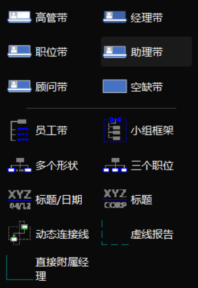

# Visio学习笔记

- 与word和ppt的基本一致

## 基础

### 开始选项卡

- 
  - 连接线：随着形状移动
  - 
    - 铅笔：以圆弧为基础，绘制自定义的曲线
    - 新插入的形状，默认在上面
- 
  - 排列：ctrl或者框选，选中多个形状，然后选择排列方式
  - 位置：横向为水平等距，纵向为垂直等距
- 
  - 分配到图层：将形状分配到不同图层
  - 图层属性
    - 
    - `#`：该图层内有多少个形状
    - 活动：新形状添加到该图层
    - 锁定：该图层内的形状不可移动
    - 粘附：连接线随形状移动

### 视图选项卡

- 
  - 形状：最左侧所有候选的形状
  - 形状数据：形状内的文本、属性
  - 大小和位置：形状的大小、位置

### 其它

- 
  - 左下角，可创建新页面
  - 页面设置：选择是前景还是背景
    - 背景会叠加在前景后面

## 快捷键

- `ctrl+d`：`ctrl+c`和`ctrl+v`
- `ctrl+g`：选中多个形状后，`ctrl+g`将其组合
  - `ctrl+u`：取消组合
- `ctrl+1`：指针工具；`ctrl+2`：文本；`ctrl+3`：连接线

## 流程图

- 新建时选择基本流程图，会自动导入基本流程图的对象
  - 也可以在左侧形状 -> 更多形状，导入基本流程图的对象

## 组织结构图

- 绘制人员组织架构
  - 
  - 拖动低级员工到高级员工旁边，自动将其连线
- 示例1：从excel直接创建组织结构图
  - excel的key：工号、职位、姓名、上级
  - 选择哪些key是内容，哪些key是关系
  - 按姓名插入照片
- 示例2：每个人加其他属性 => 根据属性，在每个人旁边加图标

