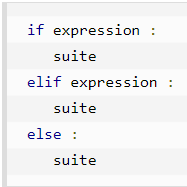
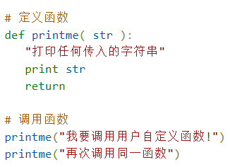

# python学习笔记

## 配置python环境及Hello World

- cmd中输入python，出现>>>提示符，则后面写的语句被python读取
- print("Hello World");
- exit()退出python

## 基础语法

- **python的所有数据均为类！**

### 缩进

- python使用缩进来分割语句，对缩进要求非常严格
- tab绑定为4个空格
- 不使用{}

### 分支



### 下划线

- `_`：临时变量

- `_var`：约定为protected变量，解释器不加以区分
- `var_`：避免重名 & 保留含义
- `__var`：private类型
  - 类内调用：`self.__var`
  - 类外调用：`对象名._类名__var`
- `__var__`：python保留名称，禁止使用

### 杂七杂八的

**字符串**

- 不需要指定变量类型
- 'hello', "hello",'''hello'''均可表示字符串，三引号可切分成多行

**注释**

- 使用#注释一行
- 使用三引号"""分别加在语句段前后注释掉整段

**可在同一行中写下多条语句**


**print输出**


### 运算符

- 兼容所有C语言的
- x**y返回x的y次幂
- x//y返回商的整数部分，如9//2=4

**位运算符**

- &：按位与	|：按位或	^：按位亦或	~：按位非
- <<：左移运算符    >>：右移运算符
-  使用位运算符时，先把十进制转二进制，对二进制进行操作，再把二进制转十进制

**逻辑运算符**

- and：逻辑与	or：逻辑或	not：逻辑非

**成员运算符**


- 使用时：a in list， b not in list
- in：若在列表中则返回true；不在则返回false
- not in ：若不在列表中则返回false；在则返回true

**身份运算符**

- is/is not：判断是否相同存储地址

- id(a)可返回变量a的存储地址

### 条件语句


- 使用if-elif-else格式，分支条件后跟:
- 没有switch
- 没有{}和end，全靠缩进来区分不同语句

### 循环语句

- 只有while和for
- break, continue, pass

### 数值型变量

- 不需提前制定变量类型
- del var删除var变量
- 支持的数值类型：整型、长整型（最后以L结尾）、浮点型、复数（a+bj表示或complex(a,b)表示）
- math（实数）, cmath（复数）模块提供了常用的数学运算函数

### 字符串

- 不支持单字符，单字符在python中也是作为一个字符串使用
- var[1:5]截取字符串中的第1-4位，从0开始编号
- +连接字符串

### 列表List

#### 基本构成

- 定义：List=["Google", 200, 0.2]，不需指定元素数据类型，使用[]定义

- print(List)则按照定义的方式显示出List

#### 切片运算

- 索引从0开始
- List[2]索引从头开始索引为2个元素，头为List[0]；List[-2]索引从尾开始第2个元素，尾为List[-1]
- List[1:6]截取List索引为1-5个元素，按顺序组合成新列表
- List[1::2]：从索引为1的元素开始，隔1个取1个

#### 常用运算符

- del List[2]删除List索引为2的元素
- List1 + List2返回由List2拼接在List1后的新列表（不改变List1）
- List1*4返回List1重复4次构成的新列表
- 3 in List判断3是否在List中
- for x in List逐次将x赋值为List中的元素，循环次数等于元素个数
- *List返回列表中的各个参数

#### 常用函数

##### 外部函数

- cmp(L1, L2)比较2个列表是否想用
- len(list)返回列表的元素个数
- max(list), min(list)返回列表的最大最小值
- list(seq)把元组转换为列表

##### 类函数

- list.append(A)将A当做新元素加入列表的最后，A可为列表：**列表套列表**
- list.extend(seq)将seq当做列表追加在list后面，使用列表的拼接
- list.count(obj)统计obj在列表中出现的次数
- list.index(obj)返回从头遍历时第1次出现obj时的索引

### 变量

### 全局变量

```python
global a  # 声明为全局变量，所有函数和类内部均可访问到
a = 10  # 全局变量需要在声明后赋值
def func():
    global b  # 在函数内部声明全局变量，函数外也可访问到
    b = 1
print(b)
```


#### 函数“静态变量”

- python只有类有静态变量，函数没有静态变量
- 但函数本身也是类，故可将函数的属性值当作“静态变量”

```python
def foo(a):
    if 'count' not in foo.__dict__:
        foo.count = 1  # 记录foo函数调用次数
    else:
        foo.count += 1
    print(a)
```

### 元组

- 元组与列表基本一致，元组使用()定义，列表使用[]定义
- 元组不可修改，列表可修改

#### 元组的定义

- 例：tup=('Homework', 2, 0.6, 'too much!')
- 只包含一个元素时，需要在后面加逗号：tup1=(68, )
- 以逗号隔开的数据默认为元组，如print 'abc', 89, 6.4默认打印的是元组

#### 元组的访问和修改

- 元组可通过索引访问
- 元组内元素不可修改，但允许连接组合为新元组
- 使用del可删除整个元组

#### 常用运算符和内置函数

##### 常用运算符

- a + b实现元组a与元组b拼接
- *a返回a中所有元素
- a in tuple判断a是否在元组tuple中

##### 内置函数

- len返回元组长度
- tuple(seq)将列表转为元组，即使其能修改

### 字典

- 字典是索引自定义的列表，基本组成为**{key: value}**
- key是value的索引，dict[key]则返回相应的value
- 对已有的key，dict[key]=value1修改value值
- 对不存在的key，dict[key]=value1则在最后补上该key和相应的value
- `del dict['Name']`：删除Name条目
- `dict.clear()`：清空字典的所有条目，但仍保留dict的变量名
- `del dict`：删除字典
- `dict.get(k, v)`：若k是dict的键，则返回`dict[k]`；若k不是dict的键，则返回v
- `dict_a.update(dict_b)`：dict_a中加入dict_b的key和value
  - 深拷贝，若key有冲突，则覆盖


### 函数

#### 基本格式



- return后写返回值，不写则默认无返回值

#### 可更改和不可更改对象

- 不可更改对象：string, tuples（元组）, numbers。需要修改时会舍弃原来的存储地址，开辟一个新地址存储
- 可更改对象：list, dict（字典）。需要修改时直接在原地址上修改
- 传入不可更改对象时，只传值
- 传入可更改对象时，传地址

#### 参数传递

- 可不按顺序、根据参数名传递参数

- ```python
  def printinfo(name, age):
      print('Name:{}'.format(name))
      print('Age:{}'.format(age))
  
  printinfo(age=50, name='miki')
  ```

- 可在函数中设置默认参数，仅当在设置默认参数后才可缺省该参数


- `*args`与`**kwargs`的使用：适用于参数数量不确定的情况
  - `*args`相当于位置参数，`kwargs`相当于关键词参数
  - `def func(*args, **kwargs)`
    - `*args`是各参数值构成的元组
    - `**kwargs`是{变量名：值}构成的字典
    - 调用函数时，未指定变量名的会被分配到args，指定变量名的会被分配给kwargs
      - `fun(1,2,3,4,A='a',B='b',C='c',D='d')`中前4个会被分配到args，后4个会被分配到kwargs
    - `def func(name,*args)`中第1个参数会被分配到name，后面的参数会被分配到args
  - `func(*args)`与`func(**kwargs)`
    - `func(*args)`将args元组中的参数按顺序分配给形参
    - `func(**kwargs)`将kwargs字典中的key与形参一一对应地传

#### 函数装饰器

- ```python
  def funcA(args):
      print('This is decorator')
  
  @funcA
  def funcB():
      print('This is main')
  
  >>> This is decorator
  ```

- funcA是装饰器，`@funcA`进行了隐式调用

  - funB函数指针作为funcA，系统执行`funcA(funcB)`

### import

- 2种执行.py方式：当作top_script或者module

  - |            | 意义                                         | 执行方法                               |
    | ---------- | -------------------------------------------- | -------------------------------------- |
    | top_script | 仅1个，`__name__`为`__main__`                | `python x.py` or `python d/x.py`       |
    | module     | import的均按module访问，`__name__`为相对路径 | `python -m x.py` or `python -m d.x.py` |

- 寻址路径

  - 对不同文件，`sys.path`固定
  - `sys.path`中保存了所有寻址路径，包含安装的库的路径
    - 若按top_script执行，则保存top_script的绝对路径
    - 若按module执行，则保存执行位置的绝对路径
  - `sys.path.append(新路径)`：加入新路径

- import：绝对导入、相对导入

  - 绝对导入：从`sys.path`中的路径下导入
  - 相对导入：相对于该文件的`__name__`
    - 从当前层导入：`import .d.x.py`
    - 从上一层导入：`import ..d.x.py`
    - 相对导入的路径的`.`数应 < `__name__`的`.`数

### 异常处理

- 常见异常
  - NotImplementedError：功能未实现
  - IOerror：读写出错

```python
try:
  command1
except IOerror:  # 出现IOerror时跳转至此执行
  command2
else:  # 正常运行结束跳转至此执行
  command3
finally:  # 无论正常or错误，都会运行finally中的命令
  command4
```

### assert

- ```python
  assert [expression], 'problem'  # experssion为False，则抛出problem异常
  ```

  - 抛出的异常为`AssertionError`
  - assert语句仅在编译器`__debug__`为True时，才会被编译进来
    - 生产环境中该项一般为False，因而不能在用于生产的代码中加入assert

### 迭代器

- 迭代器的定义与使用

  - 仅生成完上一个样本后，才生成下一个样本，不知道总样本数

  - ```python
    a = [1,2,3,4,5]  # a是Iterable
    b = iter(a)  # b是Iterator
    c = next(b)
    ```

- `Iterable`：可迭代

  - 实现了`__iter__()`或`__getitem__()`两个函数，未实现`__next__()`
  - 例：list, dict, tuple, string, ...
  - for循环处理`Iterable`时，首先调用`iter()`创建无名迭代器，再不断调用`next()`

- `Iterator`：迭代器

  - 同时实现`__iter__()`和`__next__()`两个函数
  - 可用`iter()`将非迭代器转化为迭代器
    - 调用`iter(a)`时，实际调用a的`__iter__()`
    - `__iter__()`返回迭代器，**迭代器实现了`__next__()`的对象**
    - 若a也实现了`__next__()`，则`__iter__()`可以返回self
  - 调用`next(b)`时，实际调用b的`__next__()`

### 生成器

- `generator`：1种特殊的`Iterator`

  - `Iterator`实现了如何遍历
  - `generator`不保存所有元素，每次生成下1个元素

- `yield`函数

  - yield返回生成器，

  - ```python
    def fab(max): 
        a = 0
        while a < max: 
            yield a
            a += 1
    
    mygenerator = fab(5)
    for n in fab(5): 
        print n
    ```

  - 第1次执行fab：从a=0开始执行

  - 之后执行fab：只执行while循环

  - 运行时遇到yield就保存局部变量、返回。若运行到最后一直没碰到yield，则结束

### 高阶应用 

- 海象运算符`:=`

  - 本质上仍是赋值，用于在条件中进行赋值，简化代码

  - ```python
    if (n := len(a)) > 10:  # a是字符串
        print(a)
    while (passwd := input('请输入密码:')) != '123':
        continue
    ```

## 常用函数

- `*函数名`表示函数指针

### enumerate()

- enumerate(sequence,[start=0])将可遍历的数据对象组合为一个索引序列，同时在每个数据前标上数据下标

### print()

- 格式化控制符`%`

  - 与C基本一致

  - ```python
    >>> str = "the length of (%s) is %d" %('runoob',len('runoob'))
    >>> print(str)
    the length of (runoob) is 6
    ```

  - ```py
     %c	 # 格式化字符及其ASCII码
     %s	 # 格式化字符串
     %d	 # 格式化整数
     %u	 # 格式化无符号整型
     %o	 # 格式化无符号八进制数
     %x	 # 格式化无符号十六进制数
     %X	 # 格式化无符号十六进制数（大写）
     %f	 # 格式化浮点数字，可指定小数点后的精度
    ```

- 字符串format函数

  - 可将常量和变量随时拼成字符串，打印时直接打印拼好的字符串

  - ```python
    >>> '{}  {}'.format('hello', 'world')
    'hello world'
    >>> '{1}  {0}  {1}'.format('hello', 'world')  # format里面编号从左至右递增，从0开始
    'world  hello  world'
    >>> '{w0}  {w1}'.format(w0='hello', w1='world')
    'hello world'
    ```

  - ```python
    # 通过字典设置参数
    >>> site = {'name': '菜鸟教程', 'url':'www.runoob.com'}
    >>> print('网站名:{name}, 地址{url}'.format(**site))
    ```

- `string.split(str='', num)`
  - 未给定`str`和`num`时，按照空格等默认分隔符将string切分成若干个子字符串
  - `str`给定了用于切分的分隔符
  - `num`给定了切分次数，即最终获得`num+1`个子字符串

### lambda匿名函数

- `func_name = lambda argument_list:expression`
  - `argument_list`为各形参
  - `expression`为对形参进行操作的表达式/函数，注意形式要简洁
  - `func_name`为这个函数的句柄
- lambda函数常与python内置函数相结合
  - `filter(判断函数，序列)`：判断函数（lambda函数）判断序列每个元素是否符合条件，filter函数返回所有符合条件的元素（迭代器）
  
    - ```python
      a = [1,2,3,4,5]
      b = filter(lambda x:x%2 == 0, a)  # b为迭代器
      print(*b)  # 结果为:2 4 6 8 0
      ```
  
  - `map(变换函数，序列)`：变换函数（lambda函数）对序列中每个元素进行变换，map函数返回各元素变换结果（迭代器）
  
    - ```python
      a = [1,2,3,4,5]
      c = map(lambda x:'fuck'+str(x)+'\n', a)
      # c为迭代器，加list()转为列表
      ```
  
  - `reduce(累加函数，序列)`：
    
    - 累加函数对两个输入进行自定义的累加操作
    - reduce函数按顺序将序列中的元素送入累加函数，最终返回各项自定义累加的结果
    
  - 判断函数、变换函数、累加函数常常用lambda函数代替

### isinstance()

- isinstance(a, b)：判断a与b是否是同一类型
  - 此处所有派生类与基类属于同一类型

### heapq

- 实现最小堆

- ```python
  import heapq
  a = [3, 2, 5]
  heapq.heapify(a)  # 创建最小堆
  heapq.heappush(a, 10)  # 向堆中加入，堆变大
  heapq.heappop(a)  # 弹出最小元素
  heapq.nlargest(n, a)  # 寻找a中最大的n个元素
  heapq.nsmallest(n, a)  # 寻找a中最小的n个元素
  ```

### partial

- `functools.partial(函数名，给定的函数参数)`：给定一个函数的部分参数，将其包装为一个新的函数

  - ```python
    a = partial(show, 'jab', 22)
    a('good')
    ```

