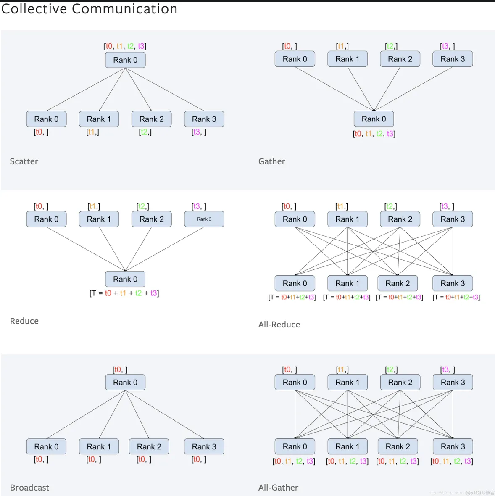

# Pytorch笔记

## Data

### Dataset

- `torch.utils.data.Dataset`：Map-style，输入index，输出样本
  
  - 需要实现`__init__`, `__len__`和`__getitem__`三个函数

- `torch.utils.data.IterableDataset`：Iterable-style，按迭代器方式输出样本，可实现dynamic batch
  
  - 需要实现`__init__`和`__iter__`两个函数
  - 不需要一次性读入数据集，也不需要知道数据集大小
  - 自行决定读取样本的顺序，无法使用sampler或者batch_sampler
  - num_workers > 0：每个子进程都会把数据全读一遍

- `torch.utils.data.ConcatDataset([Dataset1, Dataset2])`：将多个数据集拼接起来
  
  - 若拼接的数据集调用方法不同（如半监督数据集），则需要重写ConcatDataset方法

### DataLoader

- `batch_size`：自动构建batch_sampler，给出list of batch indices
  - None表示Dataset打batch（拼成torch.tensor并pad）
- `shuffle`：自动构建sampler来shuffle所有训练的index
- `num_workers`：开多少个worker加载batch
  - =0则主进程用于加载，>0则主进程不加载
  - 主进程使用batchsampler将batch分配给worker
  - worker以batch为单位读入RAM，至多预先读取`num_workers`个batch到RAM
  - 主进程在RAM中找读入的batch，若未找到则等worker加载完成
- `collate_fn`：将list of sample拼接成大tensor
  - 由`num_workers`创建的子进程调用
- DDP中，每个GPU进程各有1个dataloader

### Sampler

- Dataset：读入所有数据，每个下标对应1个样本

- Sampler: 给出样本的下标，默认是[0, 1, 2, 3, ...]

- BatchSampler: 从Sampler给出的下标中，选出要合成1个batch的下标
  
  - ```python
    class BatchSampler(Sampler):
        def __init__():
        def __len__():
        def __iter__():
    ```
  
  - num_workers将样本读入内存
  
  - batchsampler决定dataloader从内存取哪些下标

- DistributedSampler：DDP用的Sampler，只能用于Map-style dataset
  
  - 每个epoch执行1次sample，把数据切分给不同GPU
  
  - ```python
    class DistributedSampler:
        def __init_(self, shuffle, **):
            xxx
        def set_epoch(self, epoch):  # 每个epoch执行前需要重新设置，否则每轮batch里的数据都一样
            self.epoch = epoch
        def sample(self, data):
            random.Random(self.epoch).shuffle(data)  # Random()创建1个实例，seed为self.epoch，对data做shuffle
            data = data[self.rank::self.world_size]  # 切分出本机对应的数据
            data = data[self.worker_id::self.num_workers]  # 切分出Dataloader多进程加载的数据
            return data
    ```

## Tensor

- `tensor.squeeze()`与`tensor.unsqueeze()`
  
  - `tensor.squeeze()`：去除所有大小为1的维度
  - `tensor.squeeze(arg)`：若第arg维的维度值为1，则去除之，否则保持原tensor不变
  - `tensor.unsqueeze(arg)`：在第arg维插入维度值为1
  - `a = a[None, :, :] `：None代表在此位置插入维度

- Variable, Parameter, Buffer
  
  - Variable：所有输入网络的tensor都会被自动包装为Variable
    - 默认无梯度
  - Parameter：计入网络参数，随网络移动和保存，默认有梯度，可进行反向传播
    - **仅需要被更新的tensor才需要梯度**
    - 如果常量只是加入了计算图，则不需要梯度
  - Buffer：随网络移动和保存，默认无梯度
    - 随网络移动：调用`model.cuda()`会将所有buffer移动到GPU 上
    - 随网络保存：调用`model.state_dict()`时会将所有buffer保存在硬盘中
    - 使用DDP时，Parameter会自动被同步到不同GPU，但Buffer不会被自动同步
    - Buffer适合创建后不修改、希望跟随网络移动保存的，如mask
    - 创建：`self.register_buffer(name, tensor)`

- Broadcast：两个矩阵按位置相乘，形状不需要完全等，可自动进行复制
  
  - 从靠后的维度往前面的维度，进行广播
  - 若A和B在第i维的size相等or有1个为1，则将等于1的维度复制
  - 若没有该维度，则初始化为1

- `torch.Tensor.scatter_(dim, index, src, *, reduce=None)`
  
  - 将`src`的数值，按`index`给定的位置，沿`dim`维替换到`self`（原tensor）中
    
    - 对`index`的每个位置`[i][j]`
    
    - `index[i][j]`给出替换到`self`在`dim`维的维度
    
    - `src[i][j]`给出替换到`self`的值
  
  - ```python
    # 例：one-hot 编码
    # label为(0,1,2,3,...)的数值标签，num_class为类别总数
    # 转化为one_hot
    one_hot = torch.zeros((label.shape[0], len(num_class)), device=device)
    one_hot.scatter_(1, label.view(-1, 1).long(), 1)
    ```

## 梯度

- `zero_grad()`
  - `net.zero_grad()`：将网络所有需要梯度的参数的梯度置零
  - `optim.zero_grad()`将optim优化的所有参数的梯度置零
  - 若optim的参数仅指定为某网络，则`net.zero_grad()`等同于`optim.zero_grad()`
- `loss.backward()`：计算损失函数关于各个参数（网络参数等，不含输入）的梯度
  - loss必须是标量
  - 每调用1次backward，会为所有需要梯度的参数计算梯度，然后累加到该参数的已有梯度上
  - 所以每个batch都需要调用`.zerograd`
- `optimizer.step()`：在给定梯度时有不同梯度下降策略
  - 每个样本都能给出一个梯度
  - 该选择哪些样本的梯度？是否要考虑历史梯度？沿梯度方向下降的学习率如何变化？这些都由optimizer决定
  - **应在将网络移动到cuda后，再构建optimizer**
- `net.eval`与`torch.no_grad`
  - `net.eval()`用于设定dropout层和BN层，但计算过程中仍计算梯度
    - `net.train()`自动设置`self.training=True`，`net.test()`自动设置`self.training=False`
  - `torch.no_grad`用于取消计算梯度
  - `torch.inference_mode`：与`torch.no_grad`基本相同，更推荐
  - 在验证/测试时，最好都写上

## 网络

- 所有网络模块均需继承nn.Module

### 定义方式

- `nn.Sequential`：多个模块级联在一起
  
  - 指定好forward方式
  
  - 可使用OrderedDIct同时给出模块和模块名称
  
  - ```python
    layers = []
    layers.append(nn.Linear)  # 可先使用list包括所有模块
    self.net = nn.Sequential(*layers)  # 最后再转化为nn.Sequential
    ```

- `nn.ModuleList`: 使用list组合多个模块，并将它们的参数注册到网络中
  
  - ```python
    # 需手动指定forward方式
    class net_modlist(nn.Module):
        def __init__(self):
            super(net_modlist, self).__init__()
            self.modlist = nn.ModuleList([
                           nn.Conv2d(1, 20, 5),
                           nn.ReLU(),
                            nn.Conv2d(20, 64, 5),
                            nn.ReLU()])
    
        def forward(self, x):
            for m in self.modlist:
                x = m(x)
            return x
    ```
  
  - 使用append添加模块
  
  - 优点：可循环创建重复度高的网络；forward更灵活；可创建非固定网络（如Progressive GAN）

- `nn.ModuleDict`：每个模块有自己的名字
  
  - ```python
    class net_moddict(nn.Module):
        def __init__(self):
            self.moddict = nn.ModuleDict()
            self.moddict.update({'0-conv': nn.Conv2d(1, 20, 5)})
            self.moddict.update({'0-relu': nn.ReLU()})
    
        def forward(self, x):
            for n, m in self.moddict.items():
                x = m(x)
            return x
    ```

### 钩子

- 钩子：提取前向传播/反向传播后中间层的输出
  - 通过`net.named_childen()`或`net.named_modules()`找到目标中间层
  - 中间层通过`register_forward_hook()`或`register_full_backward_hook()`绑定一个处理函数
  - 处理函数的输入是中间层的输入和输出，可将其保存到其它变量中
  - 以上在初始化时进行，前向/反向传播后自动调用绑定的函数

### 参数

- 参数类型
  
  - `_parameters`：由`torch.nn.Parameter`定义
    - 调用`self.register_parameter(name, tensor)`，注册到`_parameters`这个dict
  - `_buffers`：无梯度的tensor
    - 调用`self.register_buffer(name, tensor)`
  - `_modules`：由`torch.nn.Module`定义

- 保存state_dict
  
  - `nn.Module`集成了`state_dict()`和`load_state_dict()`两个函数
  - 需要自定义state_dict，可以覆写这两个方法

### 遍历

- `net.parameters()`：层参数的迭代器

- `net.named_parameters()`：（层名，层参数）的迭代器

- `net.modules()`：层对象的迭代器

- `net.named_modules()`：（层名，层对象）的迭代器

- `net.childen()`：当前模块的直接子模块的迭代器

- `net.named_children()`：（直接子模块名，直接子模块对象）的迭代器

## cuda

- cuda相关
  - 获得gpu个数：`torch.cuda.device_count()`
  - 设定可见gpu数：`os.environ['CUDA_VISIBLE_DEVICES']='4,5,6,7'`：仅物理上的后4张卡可见
    - 程序内部使用逻辑地址指代这些卡，即物理卡4在程序中成为逻辑卡0
    - 在import torch之前
    - 也可以在命令行中输入：`CUDA_VISIBLE_DEVICES=4 python train.py`
  - `device=torch.device('cuda: {逻辑卡号}')`
  - `tensor.to(device)`，`net.to(device)`，`tensor.cuda(逻辑卡号)`
  - 不建议使用torch.cuda.set_device，推荐使用to(device)或CUDA_VISIBLE_DEVICES
- 移至cpu
  - `tensor.cpu()`
  - 需要先移回cpu才能调用.numpy()
- 几个概念
  - CUDA Toolkit：编译环境，可由conda/docker虚拟出来
  - CUDA Driver：运行环境，使用宿主机的
  - GPU Driver：硬件驱动，使用宿主机的，版本>=450.80.02向后兼容

## 多卡训练

- 判断卡：`torch.cuda.is_availabale()`, `torch.cuda.device_count`
- 查看模型在哪：`next(net.parameters()).device`

### DataParallel

- 使用DataParallel包装model, optimizer
  
  - `model = torch.nn.DataParallel(model, device_ids, out_device)`
    - `device_ids`: 用于训练的卡编号(list of int)，默认使用所有卡
    - `out_device`: 主卡号(int)，主卡用于集中计算loss，负载更大
  - 网络和数据分别需要使用`net.to(device)`和`data.to(device)`
  - 模型保存：`torch.save(net.module.state_dict(), PATH)`

- 指定主卡
  
  - ```python
    os.environ["CUDA_DEVICE_ORDER"] = "PCI_BUS_ID"
    os.environ["CUDA_VISIBLE_DEVICES"] = "2, 3"
    
    device_ids = [0, 1]
    net = torch.nn.DataParallel(net, device_ids=device_ids)
    
    optimizer = torch.optim.SGD(net.parameters(), lr=lr)
    optimizer = nn.DataParallel(optimizer, device_ids=device_ids)
    ```

### DDP

- 分布式数据并行
  
  - 多进程，推荐1个进程对应1张卡
  - 支持多机多卡，但如果能单机，就不要多机
  - 比DataParallel更高效

- 新加入的代码
  
  - ```python
    import torch.distributed as dist
    from torch.utils.data import DistributedSampler
    
    parser.add_argument('--local_rank', type=int)  # 启动器会创建多个进程，每个进程通过local_rank获得进程号
    # torch.cuda.set_device(args.local_rank)
    device = torch.device('cuda', local_rank)  # 之后可使用to(device)
    
    # 在创建网络前初始化
    # nccl适合GPU，gloo适合CPU
    dist.init_process_group(backend='nccl', init_method='env://')
    
    train_sampler = DistributedSampler(data)  # data是例化后的Dataset
    # 再去掉DataLoader中的shuffle=True，改为sampler=train_sampler，保证不同进程的数据不同
    # DataLoader的batch_size为每个进程的batch_size
    
    # 将BN设置为进程间同步参数
    net = torch.nn.SyncBatchNorm.convert_sync_batchnorm(net).to(device)
    net = torch.nn.parallel.DistributedDataParallel(
        net,
        device_ids=[local_rank],
        output_device=local_rank,
        find_unused_parameters=True
    )  # 使用DDP接口包装
    
    train_loader.sampler.set_epoch(i)  # 每个epoch计算前
    # 各子进程的DistributedSampler以epoch为种子，保证各机器shuffle出的顺序都相同
    
    # 每个epoch内必须1次forward + 1次backward，多次for/back需要合在一起（如GAN）
    
    dist.barrier()  # 用于进程间同步，仅当全部进程都被dist.barrier()阻塞后才会释放
    
    # 保存模型应保存model.module
    ```
  
  - 若需要写入日志，则仅进程0才能写入，可使用`dist.get_rank() == 0`获得进程号
  
  - 训练时必须1次forward+1次backward，对于GAN则需要将真样本和生成样本级联在一起送入D（2次forward合为1）

- 启动
  
  - ```shell
    CUDA_VISIBLE_DEVICES="4,5,6,7" python -m torch.distributed.launch --nproc_per_node 4 train.py
    ```
  
  - `CUDA_VISIBLE_DEVICES="4,5,6,7"`：指定需要哪几张卡
  
  - `--nproc_per_node 4`：指定创建几个进程

#### 概念

- 编号
  - rank：机器编号，主机（启动进程的）rank=0
    - 单机多卡只有1个主机，多机多卡才需要设置rank
  - world_size：GPU总数
  - local_rank：当前主机下的GPU编号
- 每个GPU对应1个进程，有单独的模型
  - 每个GPU分别进行前向
  - 各GPU通过Ring-Reduce机制同步梯度，边计算梯度边传梯度
    - Ring-Reduce：所有GPU串成1个环，每个GPU只与环路中下一个GPU通信，传完一圈就同步了梯度
- 

#### 同步



- `dist.gather(tensor, gather_list=None, dst=0)`
  
  - 将所有进程的tensor，汇集到rank dst的gather_list
    
    - tensor尺寸固定
    - 梯度不可反传

- `dist.all_gather(tensor_list, tensor)`
  
  - 将所有进程的tensor，汇集为gather_list，再分发给所有进程
    
    - tensor尺寸可变
    - 梯度可反传

## 琐碎

- torch.nn.Module提供了各种封装好的网络模块，torch.nn.functionals提供了各种网络运算（卷积等）

- `optim.param_groups['lr']=new_lr`：改变学习率

- `torch.jit`：just-in-time，即时编译
  
  - 将动态图转化为静态图，使之能被C++调用，加速推理
  - 两种方法
    - `torch.jit.script`：Scripting编码
    - `torch.jit.tracing`：Tracing追踪，提供输入样例
